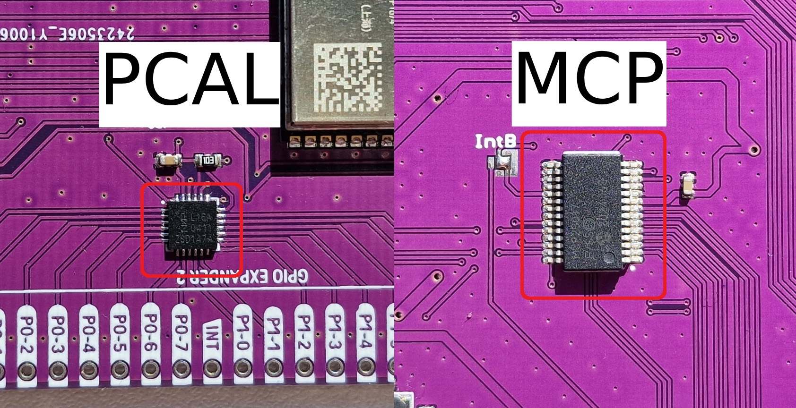

.. raw:: html

    
    
If you are not redirected, <a href="https://soldered.com/documentation/inkplate">click here</a>.

Inkplate Arduino
==================

To get started with Inkplate in Arduino IDE first select `right board <get-started.html>`_ and include Inkplate.h
    .. code-block:: c

        #include "Inkplate.h"

The variable "color" or somewhere only "c" represents a color of the pixels in different way with different display technologies.
If your Inkplate supports only black and white colors, the variable color represents color in grayscale of black mode. 0 represents
black, 7 represents white and numbers in between represents shades; 1 is the darkest gray, 6 represents the lightest gray.
If your Inkplate is 6COLOR, the next table shows values that represents colors.

=============== ================== ========== 
Color            Macro definition   Value
--------------- ------------------ ----------
Black            INKPLATE_BLACK      0
White            INKPLATE_WHITE      1
Green            INKPLATE_GREEN      2
Blue             INKPLATE_BLUE       3  
Red              INKPLATE_RED        4
Yellow           INKPLATE_YELLOW     5
Orange           INKPLATE_ORANGE     6
=============== ================== ========== 

But, if your Inkplate is Inkplate 2, then see the following table for values that represents colors:

========= ================= =====
Color     Macro Definition  Value
--------- ----------------- -----
White      INKPLATE2_WHITE    0
Black      INKPLATE2_BLACK    1
Red        INKPLATE2_RED      2
========= ================= =====
        
System Functions
----------------

Inkplate object initialization
##############################
    To use any of Inkplates functionalities in Arduino IDE you need to include Inkplate header, as mentioned on the Index and Get Started pages.
    After you've done that you can create a new instance of the Inkplate object, like this:

    .. code-block:: c

        Inkplate display(INKPLATE_1BIT);

    or

    .. code-block:: c

        Inkplate display(INKPLATE_3BIT);

    or

    .. code-block:: c

        Inkplate display;

    depending on what you need, monochrome (INKPLATE_1BIT), grayscale (INKPLATE_3BIT) functionality or Inkplate 2 and 6COLOR (no arguments passed).

    In here given examples, Inkplate object will always be named display, if not said otherwise.
    After calling this below your "#include" lines, you have access to all Inkplate functionality as display object methods.

Inkplate::begin()
#################
    | Before calling any display method you **must** call .begin() like this: 

    .. code-block:: c

        display.begin();
    
    or

    .. code-block:: c

        display.begin(lightWaveform);

* **Arguments and return value**:
    uint8_t **lightWaveform** - used only with inkplate 10 to set light mode.

    | Returns communication state

* **Description**:

    If you forget to do this most method calls will result in core panick and esp32 resetting.
    For most use cases this function is called in Arduino's setup function.
    After you've done this you can proceed calling all other methods described below.

Inkplate::sdCardInit()
######################

* **Method prototype (as seen in System.h)**:

.. code-block:: c

    int sdCardInit();

* **Arguments and return value**:
    | No Arguments

    Returns 0 if card initialization unsuccessful, else some number which casts to true.

* **Description**:
    | Used to initialize SD card interface.
    | Must be called before using SD card functionality like SdFile::read();

  | **Note**: Not supported on Inkplate 2

Inkplate::getSdFat();
#####################

* **Method prototype (as seen in System.h)**:

.. code-block:: c

    SdFat Inkplate::getSdFat()

* **Arguments and return value**:
    | No Arguments

    Returns SdFat object.

* **Description**:
    | See SdFat library documentation for use examples.

  | **Note**: Not supported on Inkplate 2

Inkplate::getSPI();
###################

* **Method prototype (as seen in System.h)**:

.. code-block:: c

    SPIClass getSPI();

* **Arguments and return value**:
    | No Arguments
    
    Returns SPIClass object.

Inkplate::waitForEpd();
##########################

* **Method prototype (as seen in System.h)**:

.. code-block:: c

    bool waitForEpd(timeout);

* **Arguments and return value**:
    | uint16_t **timeout** - Timeout for waiting

    | Returns 1 if panel is busy and 0 if panel is ready

* **Description**:
    | Waits for panel to be ready for data.

* **Example**:
    .. code-block:: c

        display.setPanelState(0);

  | **Note**: Supported only on Inkplate 2

Inkplate::setPanelState();
##########################

* **Method prototype (as seen in System.h)**:

.. code-block:: c

    void setPanelState(s);

* **Arguments and return value**:
    | uint8_t **s** panel state ON or OFF (1 or 0)

    No return value.

* **Description**:
    | Used to set if the panel on or off.

* **Example**:
    .. code-block:: c

        display.setPanelState(0);

  | **Note**: not supported on Inkplate 6COLOR and Inkplate 2

Inkplate::getPanelState();
##########################

* **Method prototype (as seen in System.h)**:

.. code-block:: c

    uint8_t getPanelState();

* **Arguments and return value**:
    | No Arguments.

    Returns 1 if eink panel is on, and 0 if it's off.

* **Description**:
    | Used to see if the panel is on.

* **Example**:
    .. code-block:: c

        Serial.print(display.getPanelState(), DEC);

  | **Note**: not supported on Inkplate 6COLOR and Inkplate 2

Inkplate::readTouchpad();
#########################

* **Method prototype (as seen in System.h)**:

.. code-block:: c

    uint8_t readTouchpad(uint8_t);

* **Arguments and return value**:
    | uint8_t **_pad** - touchpad pin to check, pass in PAD1, PAD2 or PAD3

    Returns state of the desired pad.

* **Description**:
    | readTouchpad reads touchpad pin to check if triggered

* **Example**:
    .. code-block:: c

        if (display.readTouchpad(PAD1)) 
        {
            //Do something
        }

  | **Note**: Not supported on Inkplate 6PLUS, Inkplate 2 and all newer Inkplates.

Inkplate::readTemperature();
############################

* **Method prototype (as seen in System.h)**:

.. code-block:: c

    int8_t readTemperature();

* **Arguments and return value**:
    | No arguments.

    Returns temperature in range from -10 to 85 degree C with accuracy of +-1 in range from 0 to 50.

* **Description**:
    | Can be used to determine temperature roughly.

* **Example**:
    .. code-block:: c

        Serial.print(display.readTemperature(), DEC);

  | **Note**: Not supported on Inkplate 2 or Inkplate 6COLOR

Inkplate::readBattery();
########################

* **Method prototype (as seen in System.h)**:

.. code-block:: c

    double readBattery();

* **Arguments and return value**:
    | No Arguments.

    Returns battery voltage as a double.

* **Description**:
    | Function used to determine battery voltage.
    | Can be used to display how much more time will the device be on.

* **Example**:
    .. code-block:: c

        double voltage = display.readBattery();

  | **Note**: Not supported on Inkplate Inkplate 2

Inkplate::einkOff();
####################

* **Method prototype (as seen in Inkplate.h)**:

.. code-block:: c

    void einkOff(void);

* **Arguments and return value**:
    | No Arguments.

    Returns nothing.

* **Description**:
    | Turns the panel off to save energy.

* **Example**:
    .. code-block:: c

        display.einkOff();

  | **Note**: Not supported on Inkplate 6COLOR and Inkplate 2

Inkplate::einkOn();
####################

* **Method prototype (as seen in Inkplate.h)**:

.. code-block:: c

    int einkOn(void);

* **Arguments and return value**:
    | No Arguments.

    Returns 0 if failed, 1 if succeded.

* **Description**:
    | einkOn turns on supply for epaper display (TPS65186) [+15 VDC, -15VDC, +22VDC, -20VDC, +3.3VDC, VCOM]

* **Example**:
    .. code-block:: c

        display.einkOn();

  | **Note**: Not supported on Inkplate 6COLOR and Inkplate 2

Inkplate::readPowerGood();
##########################

* **Method prototype (as seen in Inkplate.h)**:

.. code-block:: c

    int readPowerGood();

* **Arguments and return value**:
    | No Arguments.

    Returns 0 if failed, 1 if succeded.

* **Description**:
    | Reads ok status for each rail

* **Example**:
    .. code-block:: c

        int power = readPowerGood();

  | **Note**: Not supported on Inkplate 6COLOR and Inkplate 2

Inkplate::vscan_start();
########################

* **Method prototype (as seen in Inkplate.h)**:

.. code-block:: c

    void vscan_start();

* **Arguments and return value**:
    | No Arguments.

    No return.

* **Description**:
    | Starts writing new frame and skips first two lines that are invisible on screen

  | **Note**: Not supported on Inkplate 6COLOR and Inkplate 2

Inkplate::hscan_start();
########################

* **Method prototype (as seen in Inkplate.h)**:

.. code-block:: c

    void hscan_start();

* **Arguments and return value**:
    | uint32_t **_d** - Data to be written into current row.

    No return.

* **Description**:
    | Starts writing data into current row

  | **Note**: Not supported on Inkplate 6COLOR and Inkplate 2

Inkplate::vscan_end();
######################

* **Method prototype (as seen in Inkplate.h)**:

.. code-block:: c

    void vscan_end();

* **Arguments and return value**:
    | No Arguments.

    No return.

* **Description**:
    | Ends current row and prints data to screen

  | **Note**: Not supported on Inkplate 6COLOR and Inkplate 2

Inkplate::pinsZstate();
#######################

* **Method prototype (as seen in Inkplate.h)**:

.. code-block:: c

    void pinsZstate();

* **Arguments and return value**:
    | No Arguments.

    No return.

* **Description**:
    | Sets pins connected to e-paper to High-Z state(or inputs).

  | **Note**: Not supported on Inkplate 6COLOR and Inkplate 2

Inkplate::pinsAsOutputs();
##########################

* **Method prototype (as seen in Inkplate.h)**:

.. code-block:: c

    void pinsAsOutputs();

* **Arguments and return value**:
    | No Arguments.

    No return.

* **Description**:
    | Sets pins connected to e-paper to output state.

  | **Note**: not supported on Inkplate 6COLOR and Inkplate 2    

Inkplate::setFrontlight();
##########################

* **Method prototype (as seen in Inkplate.h)**:

.. code-block:: c

    void setFrontlight(uint8_t _v);

* **Arguments and return value**:
    | uint8_t **_v** - value to set frontlight to

    | No return.

* **Description**:
    | setFrontlight function sets frontlight intensity for inkplate, only for inkplate 6 plus

  | **Note**: Only supported on Inkplate 6PLUS

Inkplate::resetPanel();
#######################

* **Method prototype (as seen in Inkplate.h)**:

.. code-block:: c

    void resetPanel();

* **Arguments and return value**:
    | No arguments.

    | Returns nothing.

* **Description**:
    | resetPanel resets Inkplate 2 or 6COLOR.

Inkplate::sendCommand();
########################

* **Method prototype (as seen in Inkplate.h)**:

.. code-block:: c

    void sendCommand(uint8_t _command);

* **Arguments and return value**:
    | uint8_t **command** - predefined command for epaper control
    | Returns nothing.

* **Description**:
    | sendCommand sends SPI command to Inkplate 2 or 6COLOR.

Inkplate::sendData();
#####################

* **Method prototype (as seen in Inkplate.h)**:

.. code-block:: c

    void sendData(uint8_t *_data, int _n);

.. code-block:: c

    void sendData(uint8_t _data);

* **Arguments and return value**:
    | uint8_t* **data** - pointer to data buffer to be sent to epaper
    | int **n** - number of data bytes
    | uint8_t **data** - data buffer to be sent to epaper
    | Returns nothing.

* **Description**:
    | sendData sends SPI data to Inkplate 6COLOR or Inkplate 2.

Inkplate::setIOExpanderForLowPower;
############################

* **Method prototype (as seen in Inkplate.h)**:

.. code-block:: c

    void setIOExpanderForLowPower;

* **Arguments and return value**:
    | No arguments.
    | No return.

* **Description**:
    | setIOExpanderForLowPower initiates IO expander pins for low power, and puts
    | them in OUTPUT LOW because they are using least amount of current in deep
    | sleep that way

Drawing Functions
-----------------

Inkplate::drawPixel();
######################

* **Method prototype (as seen in Graphics.h)**:

.. code-block:: c

    void drawPixel(int16_t x0, int16_t y0, uint16_t color);

* **Arguments and return value**:
    | int16_t **x0** - x coordinate of pixel, [0, 799] in rotations 2, 4 and [0, 599] in 1, 3
    | int16_t **y0** - y coordinate of pixel, [0, 599] in rotations 2, 4 and [0, 799] in 1, 3 
    | uint16_t **color** - pixel color, in 3 bit mode in range [0, 7]

    Returns nothing.

* **Description**:
    | Most basic drawing command in the library is .drawPixel();
    | Draws one pixel at x0, y0 in desired color.
    | Requires Inkplate::display() to be called afterwards to update the screen,
    | See below.
    | On Inkplate 2 if same pixel is set to red and black color, Red will always
    | be shown. There are two buffers containing pictures ,one for black and one for red,
    | and red is drawn after black.

* **Example**:
    .. code-block:: c

        display.drawPixel(100, 50, BLACK);

* **Result**:
    | Here is what the code above produces:
    | Quite small, isn't it.

    .. image:: images/IMG_4345.jpg
        :width: 600

Inkplate::display();
####################

* **Method prototype (as seen in Inkplate.h)**:

.. code-block:: c

    void display(bool leaveOn = false);

* **Arguments and return value**:
    | bool **leaveOn** - if set to 1, it will disable turning supply for eink after display update in order to save some time needed for power supply to save some time at next display update or increase refreshing speed.

    Returns nothing.

* **Description**:
    | Displays all data in frame buffer to screen.

* **Example**:
    .. code-block:: c

        //Any drawing code
        display.drawPixel(10, 100, BLACK);

        display.display(1);

Inkplate::display1b();
######################

* **Method prototype (as seen in Inkplate.h)**:

.. code-block:: c

    void display1b(bool leaveOn = false);

* **Arguments and return value**:
    | bool **leaveOn** - if set to 1, it will disable turning supply for eink after display update in order to save some time needed for power supply to save some time at next display update or increase refreshing speed.

    | Returns nothing.

* **Description**:
    | display1b function writes black and white data to display

* **Example**:
    .. code-block:: c

        //Any drawing code
        display.drawPixel(10, 100, BLACK);

        display.display1b(1);

  | **Note**: Not supported on Inkplate 6COLOR and Inkplate 2

Inkplate::display3b();
######################

* **Method prototype (as seen in Inkplate.h)**:

.. code-block:: c

    void display3b(bool leaveOn = false);

* **Arguments and return value**:
    | bool **leaveOn** - if set to 1, it will disable turning supply for eink after display update in order to save some time needed for power supply to save some time at next display update or increase refreshing speed.

    | Returns nothing.

* **Description**:
    | display3b function writes grayscale data to display

* **Example**:
    .. code-block:: c

        //Any drawing code
        display.drawPixel(10, 100, BLACK);

        display.display3b(1);

  | **Note**: not supported on Inkplate 6COLOR and Inkplate 2

Inkplate::preloadScreen();
##########################

* **Method prototype (as seen in Inkplate.h)**:

.. code-block:: c

    void preloadScreen();

* **Arguments and return value**:
    | No Arguments

    Returns nothing.

* **Description**:
    | Copies data from partial to data buffer.

  | **Note**: not supported on Inkplate 6COLOR and Inkplate 2

Inkplate::clearDisplay();
#########################

* **Method prototype (as seen in Inkplate.h)**:

.. code-block:: c

    void clearDisplay();

* **Arguments and return value**:
    | No Arguments

    Returns nothing.

* **Description**:
    | Clears all data in buffer. Call display() after this to update/clear display.

* **Example**:
    .. code-block:: c

        display.clearDisplay();
        display.display();

Inkplate::partialUpdate();
##########################

* **Method prototype (as seen in Inkplate.h)**:

.. code-block:: c

    void partialUpdate();

or

.. code-block:: c

    void partialUpdate(bool _forced = false, bool leaveOn = false);

* **Arguments and return value**:
    | bool **_forced** - For advanced use with deep sleep. Can force partial update in deep sleep.

    | bool **leaveOn** - if set to 1, it will disable turning supply for eink after
    | display update in order to save some time needed for power supply
    | to save some time at next display update or increase refreshing speed.

    | Returns nothing.

* **Description**:
    | Updates only the changed parts of the screen. (monochrome/INKPLATE_1BIT mode only!)
    | After a few updates creates blurry parts of the screen.
    | Fixed by calling Inkplate::clean();

* **Example**:
    .. code-block:: c

        display.drawPixel(100, 50, BLACK);

        display.partialUpdate();

        display.drawPixel(100, 100, BLACK);

  | **Note**: Not supported on Inkplate 6COLOR and Inkplate 2

Inkplate::setRotation();
########################

* **Method prototype (as seen in Graphics.h)**:

.. code-block:: c

    void setRotation(uint8_t r);

* **Arguments and return value**:
    | uint8_t **r** - screen rotation.

    Returns nothing.

* **Description**:
    | Rotates the screen to be used in different orientations.
    | Default is 2, to flip 180 input 4
    | 1 and 3 are for portait mode.
    | Once flipped coordinate space remains to have the origin in the top left corner.

* **Example**:
    .. code-block:: c
        
        display.setRotation(3);

        display.setCursor(100, 100);
        display.print("INKPLATE");

* **Result**:
    | Here is what the code above produces:

    .. image:: images/IMG_4347.jpg
        :width: 600

Inkplate::selectDisplayMode();
##############################

* **Method prototype (as seen in Graphics.h)**:

.. code-block:: c

    void selectDisplayMode(uint8_t _mode)

* **Arguments and return value**:
    | uint8_t **_mode** - New display mode, INKPLATE_1BIT or INKPLATE_3BIT.

    Returns nothing.

* **Description**:
    | Changes the screen mode to from monochrome to 3 bit grayscale or vice versa.

* **Example**:
    .. code-block:: c

        display.selectDisplayMode(INKPLATE_3BIT);

  | **Note**: Not supported on Inkplate 6COLOR and Inkplate 2

Inkplate::setDisplayMode();
###########################

* **Method prototype (as seen in Graphics.h)**:

.. code-block:: c

    void setDisplayMode(uint8_t _mode)

* **Arguments and return value**:
    | uint8_t **_mode** - Mode.

    Returns nothing.

* **Description**:
    | Sets display mode

  | **Note**: not supported on Inkplate 6COLOR and Inkplate 2

Inkplate::getDisplayMode();
###########################

* **Method prototype (as seen in Graphics.h)**:

.. code-block:: c

    uint8_t getDisplayMode();

* **Arguments and return value**:
    | No arguments.

    Returns currently set display mode.

* **Description**:
    | Used to determine which display mode is currently used.
    | Returns INKPLATE_1BIT or INKPLATE_3BIT.

* **Example**:
    .. code-block:: c

        if(display.getDisplayMode() == INKPLATE_3BIT)
            Serial.println("I'm in grayscale mode!");

  | **Note**: Not supported on Inkplate 6COLOR and Inkplate 2

Inkplate::drawImage();
######################

* **Method prototype (as seen in Image.h)**:

.. code-block:: c

    bool drawImage(const char *path, int x, int y, bool dither = 1, bool invert = 0);
    bool drawImage(const String path, int x, int y, bool dither = 1, bool invert = 0);
    bool drawImage(const uint8_t *buf, int x, int y, int16_t w, int16_t h, uint8_t c = BLACK, uint8_t bg = 0xFF);
    bool drawImage(const char *path, const Format &format, const int x, const int y, const bool dither = 1, const bool invert = 0);
    bool drawImage(const String path, const Format &format, const int x, const int y, const bool dither = 1, const bool invert = 0);
    bool drawImage(const char *path, const Format &format, const Position &position, const bool dither = 1, const bool invert = 0);

* **Arguments and return value**:
    | const char ***path** - Path to file.
    | int **x** - x coordinate to draw the image at
    | int **y** - y coordinate to draw the image at
    | bool **dither** - to dither the image or not 
    | bool **invert** - invert all colors, defaults to false
    |
    | const String **path** - Path to file.
    | int **x** - x coordinate to draw the image at
    | int **y** - y coordinate to draw the image at
    | bool **dither** - to dither the image or not 
    | bool **invert** - invert all colors, defaults to false
    |
    | const uint8_t ***p** - Buffer to draw from.
    | int **x** - x coordinate to draw the image at
    | int **y** - y coordinate to draw the image at
    | int16_t **w** - x coordinate to draw the image at
    | int16_t **h** - y coordinate to draw the image at
    | bool **dither** - to dither the image or not 
    | bool **invert** - invert all colors, defaults to false
    | uint8_t **c** - color to draw 1 pixels if in BW mode
    | uint8_t **bg** - color to draw all 0 pixels if in BW mode.

    | const char ***path** - Path to file.
    | const Format **&format** - image format (bmp, jpeg, png).
    | int **x** - x coordinate to draw the image at
    | int **y** - y coordinate to draw the image at
    | bool **dither** - to dither the image or not 
    | bool **invert** - invert all colors, defaults to false

    | const String ***path** - Path to file.
    | const Format **&format** - image format (bmp, jpeg, png).
    | int **x** - x coordinate to draw the image at
    | int **y** - y coordinate to draw the image at
    | bool **dither** - to dither the image or not 
    | bool **invert** - invert all colors, defaults to false

    | const char ***path** - Path to file.
    | const Format **&format** - image format (bmp, jpeg, png).
    | const Position **&position** - image position (Center, TopLeft, BottomLeft, TopRight, BottomRight, _npos)
    | bool **dither** - to dither the image or not 
    | bool **invert** - invert all colors, defaults to false

    If you want to show an image from buffer, you can use the `Soldered Image Converter <https://github.com/SolderedElectronics/Soldered-Image-Converter/releases/>`_ to create the image .h file.

    Returns 0 if error occured, else returns 1.

* **Description**:
    | Should always have Inkplate::sdCardInit() called before if file is from SD.
    | Can draw all kinds of images, but they should have a file extensions in them.
    | Can draw from web if path starts with http:// or https:// or if not from SD.
    | Draws bmp, png and jpeg images.
    | Automatically adjusts for current display mode.
    |
    | On Inkplate 6COLOR, dither will use all of the 7 colors.
    | The default color values are:
    |
=========== ==========
 Color hex   Color
=========== ==========
 0x000000    Black
 0xFFFFFF    White
 0x00FF00    Green
 0x0000FF    Blue
 0xFF0000    Red
 0xFFFF00    Yellow
 0xFF8000    Orange
=========== ==========
    |
    | If you want to change the color palette in which the image is dithered, check the file ``/src/include/ImageDitherColor.cpp`` in your library. It has a ``palette[]`` array where you can modify the color values in hex for a different look to the dithered image.
    | The order of the colors is: [Black, White, Green, Blue, Red, Yellow, Orange]ˇ
    |
    | There is online Image converter for the Inkplate which have a presets for easier converting images for different Inkplates
    | here: https://solderedelectronics.github.io/Inkplate-image-converter/
    |
    | On Inkplate 2 if you use online image converter, include picture in header file and it will draw it in tri-color mode.

Inkplate::drawBitmapFromSD();
#############################

* **Method prototype (as seen in Image.h)**:

.. code-block:: c

    [[deprecated("Use drawImage, as this will soon become a private method.")]]
    int drawBitmapFromSD(SdFile *p, int x, int y, bool dither = false, bool invert = false);
    int drawBitmapFromSD(char *fileName, int x, int y, bool dither = false, bool invert = false);

* **Arguments and return value**:
    | SdFile ***p** - SdFile pointer to draw to screen
    | int **x** - x coordinate to draw the image at
    | int **y** - y coordinate to draw the image at
    | bool **dither** - to dither the image or not 
    | bool **invert** - invert all colors, defaults to false
    |
    | char ***fileName** - filename of the bmp on the sd card
    | int **x** - x coordinate to draw the image at
    | int **y** - y coordinate to draw the image at
    | bool **dither** - to dither the image or not 
    | bool **invert** - invert all colors, defaults to false

    Returns 0 if error occured, else returns 1.

* **Description**:
    | Should always have Inkplate::sdCardInit() called before.
    | Draws a bitmap image from sd card to screen.
    | Image can currently have 1, 4, 8 or 24 bit color depth.
    | 24 or 8 bit ones can be dithered, else the argument is ignored.
    | Info on dithering: `dithering <https://en.wikipedia.org/wiki/Floyd%E2%80%93Steinberg_dithering>`_

* **Example**:
    .. code-block:: c

        if (display.sdCardInit())
        {
            display.println("SD Card OK! Reading image...");
            display.partialUpdate();
            if(!display.drawBitmapFromSD("pandaImage.bmp", 0, 0)) {
                display.println("Image open error");
                display.display();
            }
        }

* **Result**:
    | Here is what the code above produces:

    .. image:: images/IMG_4348.jpg
        :width: 600

  | **Note**: not supported on Inkplate 2

Inkplate::drawBitmapFromWeb();
##############################

* **Method prototype (as seen in Image.h)**:

.. code-block:: c

    [[deprecated("Use drawImage, as this will soon become a private method.")]]
    int drawBitmapFromWeb(WiFiClient *s, int x, int y, int len, bool dither = false, bool invert = false);
    int drawBitmapFromWeb(char *url, int x, int y, bool dither = false, bool invert = false);

* **Arguments and return value**:
    | WiFiClient ***s** - WiFiClient stream to dowload image from.
    | int **x** - x coordinate at which to display the image.
    | int **y** - y coordinate at which to display the image.
    | int **len** - file size (header included).
    | bool **dither** - flag indicating to dither the image
    | bool **invert** - invert all image colors.
    |
    | char ***url** - url of the image.
    | int **x** - x coordinate at which to display the image.
    | int **y** - y coordinate at which to display the image.
    | bool **dither** - flag indicating to dither the image
    | bool **invert** - invert all image colors.

    Returns 0 if failed and 1 if successful.

* **Description**:
    | Draws an image from the web.
    |
    | On Inkplate 6COLOR, dither will use all of the 7 colors.
    | The default color values are:
    |
=========== ==========
 Color hex   Color
=========== ==========
 0x000000    Black
 0xFFFFFF    White
 0x00FF00    Green
 0x0000FF    Blue
 0xFF0000    Red
 0xFFFF00    Yellow
 0xFF8000    Orange
=========== ==========
    |
    | If you want to change the color palette in which the image is dithered, check the file ``/src/include/ImageDitherColor.cpp`` in your library. It has a ``palette[]`` array where you can modify the color values in hex for a different look to the dithered image.
    | The order of the colors is: [Black, White, Green, Blue, Red, Yellow, Orange]
    |
    | On Inkplate 2 if you use online image converter, include picture in header file and it will draw it in tri-color mode.
    | Make sure WiFi is setup beforehand as in examples (10-Inkplate_download_and_show).

* **Example**:
    .. code-block:: c

        if(!display.drawBitmapFromWeb("https://varipass.org/neowise_mono.bmp", 0, 0, true)) {
            display.println("Image open error");
            display.display();
        }

* **Result**:
    | Here is what the code above produces:

    .. image:: images/IMG_4349.jpg
        :width: 600

Inkplate::drawThickLine();
##########################

* **Method prototype (as seen in Shapes.h)**:

.. code-block:: c

    void drawThickLine(int x1, int y1, int x2, int y2, int color, float thickness);

* **Arguments and return value**:
    | int **x1** - x coordinate of line start, [0, 799] in rotations 2, 4 and [0, 599] in 1, 3
    | int **y1** - y coordinate of line start, [0, 599] in rotations 2, 4 and [0, 799] in 1, 3 
    | int **x2** - x coordinate of line end, [0, 799] in rotations 2, 4 and [0, 599] in 1, 3
    | int **y2** - y coordinate of line end, [0, 599] in rotations 2, 4 and [0, 799] in 1, 3 
    | int **color** - line color, in 3 bit mode in range [0, 7]
    | float **thickness** - line thickness in pixels

    Returns nothing.

* **Description**:
    | For drawing thick lines.

* **Example**:
    .. code-block:: c

        display.drawThickLine(random(0, 799), random(0, 599), random(0, 799), random(0, 599), BLACK, (float)random(1, 20));

* **Result**:
    | Here is what the code above produces:

    .. image:: images/IMG_4350.jpg
        :width: 600

Inkplate::drawGradientLine();
#############################

* **Method prototype (as seen in Shapes.h)**:

.. code-block:: c

    void drawGradientLine(int x1, int y1, int x2, int y2, int color1, int color2, float thickness = -1);

* **Arguments and return value**:
    | int **x1** - x coordinate of line start, [0, 799] in rotations 2, 4 and [0, 599] in 1, 3
    | int **y1** - y coordinate of line start, [0, 599] in rotations 2, 4 and [0, 799] in 1, 3 
    | int **x2** - x coordinate of line end, [0, 799] in rotations 2, 4 and [0, 599] in 1, 3
    | int **y2** - y coordinate of line end, [0, 599] in rotations 2, 4 and [0, 799] in 1, 3 
    | int **color1** - start line color, in 3 bit mode in range [0, 7]
    | int **color2** - start line color, in 3 bit mode in range [0, 7]
    | float **thickness** - line thickness, defaults to -1 meaning use normal, non thick, line.

    Returns nothing.

* **Description**:
    | For drawing color gradient lines.
    | color1 should always be less than color2.
    | If Inkplate 6Color is used, it will draw line in colors, so it is not recommended to use this function with Inkplate 6COLOR.

* **Example**:
    .. code-block:: c

        int startColor = random(0, 7);
        int endColor = random(startColor, 7);
        display.drawGradientLine(random(0, 799), random(0, 599), random(0, 799), random(0, 599), startColor, endColor, (float)random(1, 20));

* **Result**:
    | Here is what the code above produces:

    .. image:: images/IMG_4353.jpg
        :width: 600

Inkplate::clean();
##################

* **Method prototype (as seen in Inkplate.h)**:

.. code-block:: c

    void clean(c, rep);

| or (Inkplate 6PLUS)

.. code-block:: c

    void clean();

* **Arguments and return value**:
    | uint8_t **c** - one of four posible pixel states (0 will light screen, 1 will darken screen, 2 will discharge screen and 3 will skip).
    | uint8_t **rep** - number of repetitions.

    Returns nothing.

* **Description**:
    | Cleans the actual screen of any possible burn in.
    | Should not be used in intervals less than 5 seconds.

* **Example**:
    .. code-block:: c

        display.clean();

  | Note: Inkplate 2 does not support this function

Inkplate::fillScreen();
#######################

* **Method prototype (as seen in Adafruit_GFX.h)**:

.. code-block:: c

    void fillScreen(uint16_t color);

* **Arguments and return value**:
    | uint16_t **color** - color of the screen after filling.

    Returns nothing.

* **Description**:
    | Fills the whole screen to a solid color.

* **Example**:
    .. code-block:: c

        display.fillScreen(0);

* **Result**:
    | Here is what the code above produces:

    .. image:: images/IMG_4357.jpg
        :width: 600

Inkplate::drawRect();
#####################

* **Method prototype (as seen in Adafruit_GFX.h)**:

.. code-block:: c

    void drawRect(int16_t x, int16_t y, int16_t w, int16_t h, uint16_t color);

* **Arguments and return value**:
    | int16_t **x** - Rectangle x coordinate.
    | int16_t **y** - Rectangle y coordinate.
    | int16_t **w** - Rectangle width.
    | int16_t **h** - Rectangle height.
    | uint16_t **color** - Rectangle color (edges only, see fillRect for fully filled one).

    Returns nothing.

* **Description**:
    | Draws and empty (not filled) rectangle.

* **Example**:
    .. code-block:: c

        display.drawRect(200, 200, 400, 300, 0);

* **Result**:
    | Here is what the code above produces:

    .. image:: images/IMG_4359.jpg
        :width: 600

Inkplate::drawElipse();
#######################

* **Method prototype (as seen in Shapes.h)**:

.. code-block:: c

    void drawElipse(int rx, int ry, int xc, int yc, int c);

* **Arguments and return value**:
    | int **rx** - Elipse X radius.
    | int **ry** - Elipse Y radius.
    | int **xc** - Elipse center x.
    | int **yc** - Elipse center y.
    | int **color** - Elipse color (just the edge, see fillElipse for fully filled).

    Returns nothing.

* **Description**:
    | Draws an empty(not filled) elipse.

* **Example**:
    .. code-block:: c

       display.drawElipse(100, 200, 400, 300, 0);

Inkplate::fillElipse();
#######################

* **Method prototype (as seen in Shapes.h)**:

.. code-block:: c

    void fillElipse(int rx, int ry, int xc, int yc, int c);

* **Arguments and return value**:
    | int **rx** - Elipse X radius.
    | int **ry** - Elipse Y radius.
    | int **xc** - Elipse center x.
    | int **yc** - Elipse center y.
    | int **color** - Elipse color.

    Returns nothing.

* **Description**:
    | Draws an filled elipse.

* **Example**:
    .. code-block:: c

       display.fillElipse(100, 200, 400, 300, 0);

Inkplate::drawPolygon();
########################

* **Method prototype (as seen in ShapesPolygon.h)**:

.. code-block:: c

    void drawPolygon(int *x, int *y, int n, int color);

* **Arguments and return value**:
    | int ***x** - Polygon points X coordinates.
    | int ***y** - Polygon points Y coordinates.
    | int **n** - Number of points.
    | int **color** - Elipse color (just the edge, see fillElipse for fully filled).

    Returns nothing.

* **Description**:
    | Draws an empty(not filled) polygon.

* **Example**:
    .. code-block:: c

       display.drawPolygon(xt, yt, n, 0);

Inkplate::fillPolygon();
########################

* **Method prototype (as seen in ShapesPolygon.h)**:

.. code-block:: c

    void fillPolygon(int *x, int *y, int n, int color);

* **Arguments and return value**:
    | int ***x** - Polygon points X coordinates.
    | int ***y** - Polygon points Y coordinates.
    | int **n** - Number of points.
    | int **color** - Elipse color (just the edge, see fillElipse for fully filled).

    Returns nothing.

* **Description**:
    | Draws a filled polygon.
    | Can be quite slow.

* **Example**:
    .. code-block:: c

       display.fillPolygon(xt, yt, n, 0);

Inkplate::initedgeTable();
##########################

* **Method prototype (as seen in ShapesPolygon.h)**:

.. code-block:: c

    void initedgeTable();

* **Arguments and return value**:
    | No arguments.
    | Returns nothing

* **Description**:
    | initedgeTable initiates edge table and sets all values inside struct to 0

Inkplate::insertionSort();
##########################

* **Method prototype (as seen in ShapesPolygon.h)**:

.. code-block:: c

    void insertionSort(edgeTableTuple *ett);

* **Arguments and return value**:
    | edgeTableTuple \*ett - pointer to edgeTableTuple to be sorted.
    | Returns nothing

* **Description**:
    | insertionSort sorts buckets inside edgeTableTuple

Inkplate::storeEdgeInTuple();
#############################

* **Method prototype (as seen in ShapesPolygon.h)**:

.. code-block:: c

    void storeEdgeInTuple(edgeTableTuple *receiver, int ym, int xm, float slopInv);

* **Arguments and return value**:
    | edgeTableTuple \*receiver - pointer to edgeTableTuple structure.
    | int ym - edgeTableTuple->ymax value.
    | int xm - edgeTableTuple->xofymin value.
    | float slopInv - edgeTableTuple->slopeInverse value.
    | Returns nothing

* **Description**:
    | storeEdgeInTuple stores values in tuple structure

Inkplate::storeEdgeInTable();
#############################

* **Method prototype (as seen in ShapesPolygon.h)**:

.. code-block:: c

    void storeEdgeInTable(int x1, int y1, int x2, int y2);

* **Arguments and return value**:
    | int x1 - x plane starting position.
    | int y1 - y plane starting position.
    | int x2 - x plane ending position.
    | int y2 - y plane ending position.
    | Returns nothing

* **Description**:
    | storeEdgeInTable calculates edge values of edgeTableTuple and stores them

Inkplate::removeEdgeByYmax();
#############################

* **Method prototype (as seen in ShapesPolygon.h)**:

.. code-block:: c

    void removeEdgeByYmax(edgeTableTuple *tup, int yy);

* **Arguments and return value**:
    | edgeTableTuple \*tup - pointer to edgeTableTuple to work on.
    | int yy - value to remove from edgeTableTuple.
    | Returns nothing

* **Description**:
    | removeEdgeByYmax removes edge by given yy

Inkplate::updatexbyslopeinv();
##############################

* **Method prototype (as seen in ShapesPolygon.h)**:

.. code-block:: c

    void updatexbyslopeinv(edgeTableTuple *tup);

* **Arguments and return value**:
    | edgeTableTuple \*tup - pointer to edgeTableTuple to work on.
    | Returns nothing

* **Description**:
    | updatexbyslopeinv updates all xofymin by adding slopeinverse

Inkplate::scanlineFill();
#########################

* **Method prototype (as seen in ShapesPolygon.h)**:

.. code-block:: c

    void scanlineFill(uint8_t c);

* **Arguments and return value**:
    | uint8_t c - color.
    | Returns nothing

* **Description**:
    | scanlineFill dravs horizontal line based on edge table

Inkplate::drawCircle();
#######################

* **Method prototype (as seen in Adafruit_GFX.h)**:

.. code-block:: c

    void drawCircle(int16_t x0, int16_t y0, int16_t r, uint16_t color);

* **Arguments and return value**:
    | int16_t **x0** - Circle center x coordinte.
    | int16_t **y0** - Circle center y coordinate.
    | int16_t **r** - Circle radius.
    | uint16_t **color** - Circle color (just the edge, see fillCircle for fully filled).

    Returns nothing.

* **Description**:
    | Draws an empty(not filled) circle.

* **Example**:
    .. code-block:: c

        display.drawCircle(400, 300, 75, 0);

* **Result**:
    | Here is what the code above produces:

    .. image:: images/IMG_4360.jpg
        :width: 600

Inkplate::fillCircle();
#######################

* **Method prototype (as seen in Adafruit_GFX.h)**:

.. code-block:: c

    void fillCircle(int16_t x0, int16_t y0, int16_t r, uint16_t color);

* **Arguments and return value**:
    | int16_t **x0** - Circle center x coordinte.
    | int16_t **y0** - Circle center y coordinate.
    | int16_t **r** - Circle radius.
    | uint16_t **color** - Circle color (fully filled).

    Returns nothing.

* **Description**:
    | Draws a filled circle to screen in a supplied color.

* **Example**:
    .. code-block:: c

        display.fillCircle(random(0, 799), random(0, 599), 15, random(0, 7));

* **Result**:
    | Here is what the code above produces:

    .. image:: images/IMG_4361.jpg
        :width: 600

Inkplate::drawTriangle();
#########################

* **Method prototype (as seen in Adafruit_GFX.h)**:

.. code-block:: c

    void drawTriangle(int16_t x0, int16_t y0, int16_t x1, int16_t y1,
      int16_t x2, int16_t y2, uint16_t color);

* **Arguments and return value**:
    | int16_t **x0** - First point x coordinate.
    | int16_t **y0** - First point y coordinate.
    | int16_t **x1** - Second point x coordinate.
    | int16_t **y1** - Second point y coordinate.
    | int16_t **x2** - Third point x coordinate.
    | int16_t **y2** - Third point y coordinate.
    | uint16_t **color** - Triangle edge color(see fillTriangle for a fully filled one).

    Returns nothing.

* **Description**:
    | Draw an empty rectangle to screen.

* **Example**:
    .. code-block:: c

        display.drawTriangle(250, 400, 550, 400, 400, 100, 0);

* **Result**:
    | Here is what the code above produces:

    .. image:: images/IMG_4362.jpg
        :width: 600

Inkplate::fillTriangle();
#########################

* **Method prototype (as seen in Adafruit_GFX.h)**:

.. code-block:: c

    void fillTriangle(int16_t x0, int16_t y0, int16_t x1, int16_t y1,
      int16_t x2, int16_t y2, uint16_t color);

* **Arguments and return value**:
    | int16_t **x0** - First point x coordinate.
    | int16_t **y0** - First point y coordinate.
    | int16_t **x1** - Second point x coordinate.
    | int16_t **y1** - Second point y coordinate.
    | int16_t **x2** - Third point x coordinate.
    | int16_t **y2** - Third point y coordinate.
    | uint16_t **color** - Triangle fill color.

    Returns nothing.

* **Description**:
    | Draw a rectangle filled with a certain color.

* **Example**:
    .. code-block:: c

        display.fillTriangle(300, 350, 500, 350, 400, 150, 0);

* **Result**:
    | Here is what the code above produces:

    .. image:: images/IMG_4363.jpg
        :width: 600

Inkplate::drawRoundRect();
##########################

* **Method prototype (as seen in Adafruit_GFX.h)**:

.. code-block:: c

    void drawRoundRect(int16_t x0, int16_t y0, int16_t w, int16_t h,
      int16_t radius, uint16_t color);

* **Arguments and return value**:
    | int16_t **x0** - Rectangle x coordinate.
    | int16_t **y0** - Rectangle y coordinate.
    | int16_t **w** - Rectangle width.
    | int16_t **h** - Rectangle height.
    | int16_t **radius** - Curvature radius of the edges.
    | uint16_t **color** - Rectangle edges color (for a fully filled one see fillRoundRect).

    Returns nothing.

* **Description**:
    | Draws an empty (not filled) rectangle with round edges to screen.

* **Example**:
    .. code-block:: c

        display.drawRoundRect(200, 200, 400, 300, 10, 0); 

* **Result**:
    | Here is what the code above produces:

    .. image:: images/IMG_4364.jpg
        :width: 600

Inkplate::fillRoundRect();
##########################

* **Method prototype (as seen in Adafruit_GFX.h)**:

.. code-block:: c

    void fillRoundRect(int16_t x0, int16_t y0, int16_t w, int16_t h,
      int16_t radius, uint16_t color);

* **Arguments and return value**:
    | int16_t **x0** - Rectangle x coordinate.
    | int16_t **y0** - Rectangle y coordinate.
    | int16_t **w** - Rectangle width.
    | int16_t **h** - Rectangle height.
    | int16_t **radius** - Curvature radius of the edges.
    | uint16_t **color** - Rectangle fill color.

    Returns nothing.

* **Description**:
    | Draws a fully filled rectangle with rounded corners to screen.

* **Example**:
    .. code-block:: c

        display.fillRoundRect(200, 200, 400, 300, 10, 0);

* **Result**:
    | Here is what the code above produces:

    .. image:: images/IMG_4365.jpg
        :width: 600

Inkplate::drawBitmap();
#######################

* **Method prototype (as seen in Adafruit_GFX.h)**:

.. code-block:: c

    void drawBitmap(int16_t x, int16_t y, const uint8_t bitmap[],
      int16_t w, int16_t h, uint16_t color);

    void drawBitmap(int16_t x, int16_t y, const uint8_t bitmap[],
      int16_t w, int16_t h, uint16_t color, uint16_t bg);

    void drawBitmap(int16_t x, int16_t y, uint8_t *bitmap,
      int16_t w, int16_t h, uint16_t color);

    void drawBitmap(int16_t x, int16_t y, uint8_t *bitmap,
      int16_t w, int16_t h, uint16_t color, uint16_t bg);

* **Arguments and return value**:
    | int16_t **x** - Bitmap x coordinate.
    | int16_t **y** - Bitmap y coordinate.
    | const uint8_t **bitmap** [] - Buffer storing the image information.
    | int16_t **w** - Bitmap width.
    | int16_t **h** - Bitmap height.
    | uint16_t **color** - Color to draw pixels marked with a 1.
    |
    | int16_t **x** - Bitmap x coordinate.
    | int16_t **y** - Bitmap y coordinate.
    | const uint8_t **bitmap** [] - Buffer storing the image information.
    | int16_t **w** - Bitmap width.
    | int16_t **h** - Bitmap height.
    | uint16_t **color** - Color to draw pixels marked with a 1.
    | uint16_t **bg** - Color to draw pixels marked with a 0.
    |
    | int16_t **x** - Bitmap x coordinate.
    | int16_t **y** - Bitmap y coordinate.
    | const uint8_t ***bitmap** - Buffer storing the image information.
    | int16_t **w** - Bitmap width.
    | int16_t **h** - Bitmap height.
    | uint16_t **color** - Color to draw pixels marked with a 1.
    |
    | int16_t **x** - Bitmap x coordinate.
    | int16_t **y** - Bitmap y coordinate.
    | const uint8_t ***bitmap** - Buffer storing the image information.
    | int16_t **w** - Bitmap width.
    | int16_t **h** - Bitmap height.
    | uint16_t **color** - Color to draw pixels marked with a 1.
    | uint16_t **bg** - Color to draw pixels marked with a 0.

    Returns nothing.

* **Description**:
    | Draws a monochrome bitmap to screen. 
    | To get image data, use LCD image Converter.

* **Example**:
    .. code-block:: c

        display.drawBitmap(100, 250, logo, 576, 100, BLACK);

* **Result**:
    | Here is what the code above produces:

    .. image:: images/IMG_4366.jpg
        :width: 600

Inkplate::drawBitmap3Bit();
###########################

* **Method prototype (as seen in Image.h)**:

.. code-block:: c

    void drawBitmap3Bit(int16_t _x, int16_t _y, const unsigned char *_p, int16_t _w, int16_t _h);

* **Arguments and return value**:
    | int16_t **_x** - x coordinate of image corner, [0, 799] in rotations 2, 4 and [0, 599] in 1, 3
    | int16_t **_y** - y coordinate of image corner, [0, 599] in rotations 2, 4 and [0, 799] in 1, 3 
    | const unsigned char ***_p** - unsigned char buffer containing bitmap data
    | int16_t **_w** - image width
    | int16_t **_h** - image height

    Returns nothing.

* **Description**:
    | Draws a bitmap image to screen.
    | Image data can be created using online tools or supplied Python script in some examples.
    | If Inkplate 6COLOR is used, this function will draw image in 7-color mode, otherwise it will draw image in grayscale mode.

* **Example**:
    .. code-block:: c

        //Picture is a predefined image buffer (const uint8_t, see 2-Inkplate_basic_grayscale example)
        display.drawBitmap3Bit(0, 0, picture, 800, 600);

* **Result**:
    | Here is what the code above produces:

    .. image:: images/IMG_4369.jpg
        :width: 600

Inkplate::drawChar();
#####################

* **Method prototype (as seen in Adafruit_GFX.h)**:

.. code-block:: c

    void drawChar(int16_t x, int16_t y, unsigned char c, uint16_t color,
      uint16_t bg, uint8_t size);
    void drawChar(int16_t x, int16_t y, unsigned char c, uint16_t color,
	      uint16_t bg, uint8_t size_x, uint8_t size_y);

* **Arguments and return value**:
    | No arguments.

    Returns nothing.

* **Description**:
    | Draws characters to the screen

* **Example**:
    .. code-block:: c

        display.drawChar();

* **Result**:
    | Here is what the code above produces:

    .. image:: images/IMG_4371.jpg
        :width: 600

Inkplate::getTextBounds();
##########################

* **Method prototype (as seen in Adafruit_GFX.h)**:

.. code-block:: c

    void getTextBounds(const char *string, int16_t x, int16_t y,
      int16_t *x1, int16_t *y1, uint16_t *w, uint16_t *h);
    void getTextBounds(const __FlashStringHelper *s, int16_t x, int16_t y,
      int16_t *x1, int16_t *y1, uint16_t *w, uint16_t *h);
    void getTextBounds(const String &str, int16_t x, int16_t y,
      int16_t *x1, int16_t *y1, uint16_t *w, uint16_t *h);

* **Arguments and return value**:
    | const char ***string** - Text string from a char buffer (c style string - preferred).
    | int16_t **x** - Starting x coordinate.
    | int16_t **y** - Starting y coordinate.
    | int16_t ***x1** - Pointer showing where to put end x coordinate.
    | int16_t ***y1** - Pointer showing where to put end y coordinate.
    | uint16_t ***w** - Pointer showing where to put text width.
    | uint16_t ***h** -Pointer showing where to put text height.
    |
    | const __FlashStringHelper ***s** - Text string from a flash string (preferred when string doesn't have to be changed)
    | int16_t **x** - Starting x coordinate.
    | int16_t **y** - Starting y coordinate.
    | int16_t ***x1** - Pointer showing where to put end x coordinate.
    | int16_t ***y1** - Pointer showing where to put end y coordinate.
    | uint16_t ***w** - Pointer showing where to put text width.
    | uint16_t ***h** -Pointer showing where to put text height.
    |
    | String &**string** - Text string from a String object reference (should be avoided).
    | int16_t **x** - Starting x coordinate.
    | int16_t **y** - Starting y coordinate.
    | int16_t ***x1** - Pointer showing where to put end x coordinate.
    | int16_t ***y1** - Pointer showing where to put end y coordinate.
    | uint16_t ***w** - Pointer showing where to put text width.
    | uint16_t ***h** -Pointer showing where to put text height.

    Returns nothing.

* **Description**:
    | Puts data about text box end coordinates, width and height in variable pointers.

* **Example**:
    .. code-block:: c

        int16_t x, y;
        uint16_t w, h;

        display.getTextBounds("Some text", 0, 0, &x, &y, &w, &h);

        // Now x, y, w and h were set to respected values

Inkplate::setTextSize();
########################

* **Method prototype (as seen in Adafruit_GFX.h)**:

.. code-block:: c

    void setTextSize(uint8_t s);
    void setTextSize(uint8_t sx, uint8_t sy);

* **Arguments and return value**:
    | uint8_t **s** - font scale
    | 
    | uint8_t **sx** - font x scale
    | uint8_t **sy** - font y scale

    Returns nothing.

* **Description**:
    | Scales the font to some value.

* **Example**:
    .. code-block:: c

        display.setTextSize(4);
        display.print("Welcome to Inkplate 6!");

Inkplate::setFont();
####################

* **Method prototype (as seen in Adafruit_GFX.h)**:

.. code-block:: c

    void setFont(const GFXfont *f = NULL);

* **Arguments and return value**:
    | const GFXfont ***f** - font struct pointer, defaults to NULL meaning default font

    Returns nothing.

* **Description**:
    | Used to change the text font.
    | Fonts can be found in the supplied Fonts folder or made using tools.
    | Example tool: `font converter <https://oleddisplay.squix.ch/#/home>`_ (select Library version -> gfx font)

* **Example**:
    .. code-block:: c

        //Font has to be included
        display.setFont(&Not_Just_Groovy20pt7b);
        display.println("Inkplate 6");

* **Result**:
    | Here is what the code above produces:

    .. image:: images/IMG_4371.jpg
        :width: 600

Inkplate::setCursor();
######################

* **Method prototype (as seen in Adafruit_GFX.h)**:

.. code-block:: c

    void setCursor(int16_t x, int16_t y);

* **Arguments and return value**:
    | int16_t **x** - Cursor x position. 
    | int16_t **y** - Cursor y position.

    Returns nothing.

* **Description**:
    | Sets the cursor text position. 

* **Example**:
    .. code-block:: c

        display.setCursor(0, 550);
        display.print("Some text");

* **Result**:
    | Here is what the code above produces:

    .. image:: images/IMG_4373.jpg
        :width: 600

Inkplate::print();
##################

* **Method prototype**:

.. code-block:: c

    void print(char *s);
    void print(String &s);

* **Arguments and return value**:
    | char ***s** - C string to be printed. 
    |
    | String &**s** - String to be printed.

    Returns nothing.

* **Description**:
    | Puts the text on screen. 

* **Example**:
    .. code-block:: c

        display.print("Some text");

* **Result**:
    | Here is what the code above produces:

    .. image:: images/IMG_4373.jpg
        :width: 600

Inkplate::println();
####################

* **Method prototype**:

.. code-block:: c

    void println(char *s);
    void println(String &s);

* **Arguments and return value**:
    | char ***s** - C string to be printed. 
    |
    | String &**s** - String to be printed.

    Returns nothing.

* **Description**:
    | Essentially the same as print but adds a new line to end.

* **Example**:
    .. code-block:: c
    
        display.println("Some text");

Inkplate::drawTextWithShadow();
###############################

* **Method prototype**:

.. code-block:: c

    void drawTextWithShadow(int x, int y, const char *_c, uint8_t _color1, uint8_t color2);

* **Arguments and return value**:
    | int x - x coordinate. 
    |
    | int y - y coordinate.
    |
    | const char \*_c - pointer to array of chars to be printed.
    |
    | uint8_t _color1 - Color of text.
    |
    | uint8_t color2 - Color of shadow.

    Returns nothing.

* **Description**:
    | Prints text with shadow on specific location.

* **Example**:
    .. code-block:: c
    
        display.drawTextWithShadow(20,40, "Text", RED, BLACK);

Inkplate::setTextWrap();
########################

* **Method prototype (as seen in Adafruit_GFX.h)**:

.. code-block:: c

    void setTextWrap(boolean w);

* **Arguments and return value**:
    | boolean **w** - to wrap or not to wrap text.

    Returns nothing.

* **Description**:
    | Wrap text thats gone of the edge.

* **Example**:
    .. code-block:: c

        //Disables text wrapping
        display.setTextWrap(false); 

Inkplate::width();
##################

* **Method prototype (as seen in Graphics.h)**:

.. code-block:: c

    int16_t width(void);

* **Arguments and return value**:
    | No arguments.

* **Description**:
    | Returns screen width.

* **Example**:
    .. code-block:: c

        display.width();

Inkplate::height();
###################

* **Method prototype (as seen in Graphics.h)**:

.. code-block:: c

    int16_t height(void);

* **Arguments and return value**:
    | No arguments.

    Returns nothing.

* **Description**:
    | Returns screen height.

* **Example**:
    .. code-block:: c

        display.height();

Inkplate::getRotation();
########################

* **Method prototype (as seen in Graphics.h)**:

.. code-block:: c

    int16_t getRotation(void);

* **Arguments and return value**:
    | No arguments.

    Returns nothing.

* **Description**:
    | Returns screen rotation, in range [0,3], 2 is default.

* **Example**:
    .. code-block:: c

        if(display.getRotation() == 4)
            Serial.println("I'm upside down!");

Inkplate::getCursorX();
#######################

* **Method prototype (as seen in Adafruit_GFX.h)**:

.. code-block:: c

    int16_t getCursorX(void);

* **Arguments and return value**:
    | No arguments.

    Returns nothing.

* **Description**:
    | Returns text cursor x coordinate.

* **Example**:
    .. code-block:: c

        if(display.getCursorX() > 400)
            Serial.println("Were in the second half of the screen!");

Inkplate::getCursorY();
#######################

* **Method prototype (as seen in Adafruit_GFX.h)**:

.. code-block:: c

    int16_t getCursorY(void);

* **Arguments and return value**:
    | No arguments.

    Returns nothing.

* **Description**:
    | Returns text cursor y coordinate.

* **Example**:
    .. code-block:: c

        if(display.getCursorY() > 300)
            Serial.println("Were in the bottom half of the screen!");

IO Expander Functions
----------------

| Depending on which Inkplate you have, there are 2, 1, or no GPIO expanders.
| There are 2 types of GPIO expanders on the Inkplate boards: MCP23017 and PCAL6416A.
| The table below shows which GPIO expanders can be found on which Inkplate.
| We call them internal and external. The internal one is needed for the e-paper and PMIC
| to work (on certain Inkplates), and the second is just for more GPIO pins if 
| users want to use them. 

+-------------------+------------+---------------+---------------+----------------+---------------+----------------+---------------+----------------+---------------+
|                   | Inkplate 2 |        Inkplate 6 COLOR       |         Inkplate 6 PLUS        |             Inkplate 6         |       Inkplate 10              |
+===================+============+===============+===============+================+===============+================+===============+================+===============+
| GPIO expander     | Doesn't exist |              PCAL             |       MCP      |      PCAL     |       MCP      |      PCAL     |       MCP      |      PCAL     |
+-------------------+------------+---------------+---------------+----------------+---------------+----------------+---------------+----------------+---------------+
| Available pins on |     X      |               X               | GPB1*,         | P1-1*, P1-5*, | GPB1* - GPB4*, | P1-1*, P1-2*, | GPB1* - GPB4*, | P1-1*, P1-2*, | 
| internal expander |            |                               | GPB5 - GPB7    | P1-6, P1-7    | GPB5 - GPB7    | P1-3 - P1-7   | GPB5 - GPB7    | P1-3 - P1-7   |
+-------------------+------------+---------------+---------------+----------------+---------------+----------------+---------------+----------------+---------------+
| Available pins on |     X      | P1-1*, P1-2*, all other pins  |      All**     |      All      |      All**     |      All      |      All**     |      All      |
| external expander |            |                               |                |               |                |               |                |               |
+-------------------+------------+---------------+---------------+----------------+---------------+----------------+---------------+----------------+---------------+

| \* You can use this pin as GPIO, but you have to cut the certain jumper and connect it to the other side because it originally has another functionality. This functionality is not necessarily needed for e-paper to work, but can be useful so we set it as the default.
| \*\* Some Inkplates have 1 MCP expander because of chip shortage so you can't use any on the external IO expander

| **DO NOT USE** pins that are not available! 
| Using those, you might **permanently damage the screen**. Usage is limited by the library, 
| but just in case don't use them! For the specific pin purpose, see the hardware-reference.

| If you look at the back of the Inkplate and follow the lines from the GPIO expander pins, 
| you will see the IO expander IC. If your Inkplate has a smaller one (QFN-24 package), it is PCAL. 
| If there is a bigger IC (28-pin SSOP package), it is the MCP expander.

| The picture below shows the difference in their dimensions so you can easily recognize what expander your Inkplate has.

| If you have a blue PCB, don't worry. It is just old color before rebranding to Soldered. We also maintain it. It comes only with MCP expanders.

| If your Inkplate has a PCAL expander, you must use the "Soldered Inkplate ..." 
| board definition, otherwise choose the "e-radionica Inkplate ..." board in Arduino IDE.

| IO Expander is started inside Inkplate.begin() function so you need only to call
| that and everything is set for IO Expander. All user pins on the expander are set 
| to pin mode OUTPUT and LOW state because of saving energy.

.. code-block:: c 

    Inkplate display(INKPLATE_1BIT); // Or INKPLATE_3BIT
    display.begin();

| Inkplate 6COLOR has only one IO Expander used as an external IO expander.

| Inkplate 2 has no IO Expanders so all these functions will not work on Inkplate 2!

Common Functions
################

Inkplate::ioBegin();
********************

* **Method prototype (as seen in Mcp.h and Pcal.h)**:

.. code-block:: c 

    bool ioBegin(uint8_t _addr, uint8_t *_r);

* **Arguments and return value**:
    | uint8_t _addr - IO Exapnder I2C address.
    | uint8_t \*_r - pointer to array to be writen in registers.
    | Returns true if successful, false otherwise.

* **Description**:
    | ioBegin function starts io expander and sets registers values.

Inkplate::pinModeIO();
**********************

* **Method prototype (as seen in Mcp.h and Pcal.h)**:

.. code-block:: c 

    void pinModeIO(uint8_t _pin, uint8_t _mode, uint8_t _io_id = IO_EXT_ADDR);

* **Arguments and return value**:
    | uint8_t _pin - pin number.
    | uint8_t _mode - mode to be set (INPUT, OUTPUT or INPUT_PULLUP).
    | uint8_t _io_id - internal or external io exapnder.
    | Returns nothing.

* **Description**:
    | Sets io expander pin mode.

* **Example**:
    .. code-block:: c

        display.pinModeIO(LED_PIN, OUTPUT);

Inkplate::pinModeInternal();
****************************

* **Method prototype (as seen in Mcp.h and Pcal.h)**:

.. code-block:: c 

    void pinModeInternal(uint8_t _addr, uint8_t *_r, uint8_t _pin, uint8_t _mode);

* **Arguments and return value**:
    | uint8_t _addr - IO Exapnder I2C address.
    | uint8_t \*_r - pointer to array that holds io expander registers.
    | uint8_t _pin - pin to set mode.
    | uint8_t _mode - mode for pi to be set (INPUT=0x01, OUTPUT=0x02, INPUT_PULLUP=0x05).
    | Returns nothing.

* **Description**:
    | pinModeInternal sets io expanders internal pin mode.

Inkplate::digitalWriteInternal();
*********************************

* **Method prototype (as seen in Mcp.h and Pcal.h)**:

.. code-block:: c 

    void digitalWriteInternal(uint8_t _addr, uint8_t *_r, uint8_t _pin, uint8_t _state);

* **Arguments and return value**:
    | uint8_t _addr - IO Exapnder I2C address.
    | uint8_t \*_r - pointer to array that holds io expander registers.
    | uint8_t _pin - pin to set mode.
    | uint8_t _state -  output pin state (0 or 1).
    | Returns nothing.

* **Description**:
    | digitalWriteInternal sets internal output pin state (1 or 0).

Inkplate::digitalWriteIO();
***************************

* **Method prototype (as seen in Mcp.h and Pcal.h)**:

.. code-block:: c 

    void digitalWriteIO(uint8_t _pin, uint8_t _state, uint8_t _io_id = IO_EXT_ADDR);

* **Arguments and return value**:
    | uint8_t _pin - pin number.
    | uint8_t _state - pin state (HIGH or LOW).
    | uint8_t _io_id - internal or external io exapnder.
    | Returns nothing.

* **Description**:
    | Sets io exapnder output pin state.

* **Example**:
    .. code-block:: c

        display.digitalWriteIO(LED_PIN, HIGH);

Inkplate::digitalReadInternal();
********************************

* **Method prototype (as seen in Mcp.h and Pcal.h)**:

.. code-block:: c 

    void digitalReadInternal(uint8_t _addr, uint8_t *_r, uint8_t _pin);

* **Arguments and return value**:
    | uint8_t _addr - io expander i2c address.
    | uint8_t \*_r - pointer to array that holds io expander registers.
    | uint8_t _pin - pin to set mode.
    | Returns nothing.

* **Description**:
    | digitalReadInternal reads io expander internal pin state.

Inkplate::digitalReadIO();
**************************

* **Method prototype (as seen in Mcp.h and Pcal.h)**:

.. code-block:: c 

    uint8_t digitalReadIO(uint8_t _pin, uint8_t _io_id = IO_EXT_ADDR);

* **Arguments and return value**:
    | uint8_t _pin - pin number.
    | uint8_t _io_id - internal or external io exapnder.
    | Returns HIGH or LOW value (1 or 0).

* **Description**:
    | digitalReadIO reads io exapnder internal pin state.

* **Example**:
    .. code-block:: c

        display.digitalReadIO(LED_PIN);

Inkplate::removeIntPin();
*************************

* **Method prototype (as seen in Mcp.h and Pcal.h)**:

.. code-block:: c 

    void removeIntPin(uint8_t _pin, uint8_t _io_id = IO_EXT_ADDR);

* **Arguments and return value**:
    | uint8_t _pin - pin number.
    | uint8_t _io_id - internal or external io exapnder.
    | Returns nothing.

* **Description**:
    | Removes interrupt from pin.

* **Example**:
    .. code-block:: c

        display.removeIntPin(touchPadPin);

Inkplate::removeIntPinInternal();
*********************************

* **Method prototype (as seen in Mcp.h and Pcal.h)**:

.. code-block:: c 

    void removeIntPinInternal(uint8_t _addr, uint8_t *_r, uint8_t _pin);

* **Arguments and return value**:
    | uint8_t _addr - io expander i2c address.
    | uint8_t \*_r - pointer to array that holds io expander registers.
    | uint8_t _pin - pin number.
    | Returns nothing.

* **Description**:
    | Removes interrupt from pin.

Inkplate::getINT();
*******************

* **Method prototype (as seen in Mcp.h and Pcal.h)**:

.. code-block:: c 

    uint16_t getINT(uint8_t _io_id = IO_EXT_ADDR);

* **Arguments and return value**:
    | uint8_t _io_id - internal or external io exapnder.
    | Returns interupt registers state.

* **Description**:
    | Returns interrupt registers state for portA and portB. 
    | Every bit represents interrupt pin, MSB is  PORTB PIN7, LSB is PORTA PIN1.

* **Example**:
    .. code-block:: c

        display.getINT();

Inkplate::setPorts();
*********************

* **Method prototype (as seen in Mcp.h and Pcal.h)**:

.. code-block:: c 

    void setPorts(uint16_t _d, uint8_t _io_id = IO_EXT_ADDR);

* **Arguments and return value**:
    | uint16_t _d - value to be writen to port A and port B registers.
    | uint8_t _io_id - internal or external io exapnder.
    | Returns nothing.

* **Description**:
    | Sets internal state of PORTA and PORTB registers.
    | MSB byte is for PORTB, LSB byte for PORTA.

* **Example**:
    .. code-block:: c

        uint16_t data = 0xFFFF; // To make all bits ones
        display.setPorts(data);

Inkplate::setPortsInternal();
*****************************

* **Method prototype (as seen in Mcp.h and Pcal.h)**:

.. code-block:: c 

    void setPorts(uint8_t _addr, uint8_t *_r, uint16_t _d);

* **Arguments and return value**:
    | uint8_t _addr - io expander i2c address.
    | uint8_t \*_r - pointer to array that holds io expander registers.
    | uint16_t _d - value to be writen to port A and port B registers.
    | Returns nothing.

* **Description**:
    | setPortsInternal sets internal state of PORTAB registers.

Inkplate::getPorts();
*********************

* **Method prototype (as seen in Mcp.h and Pcal.h)**:

.. code-block:: c 

    uint16_t getPorts(uint8_t _io_id = IO_EXT_ADDR);

* **Arguments and return value**:
    | uint8_t _io_id - internal or external io exapnder.
    | Returns register states of PORTA and PORTB.

* **Description**:
    | Returns states of PORTA and PORTB registers.
    | MSB byte is for PORTB, LSB is for PORTA.

* **Example**:
    .. code-block:: c

        display.getPorts();

Inkplate::getPortsInternal();
*****************************

* **Method prototype (as seen in Mcp.h and Pcal.h)**:

.. code-block:: c 

    uint16_t getPortsInternal(uint8_t _addr, uint8_t *_r);

* **Arguments and return value**:
    | uint8_t _addr - io expander i2c address.
    | uint8_t \*_r pointer to array that holds io exapnder registers
    | Returns register states of PORTA and PORTB.

* **Description**:
    | Returns internal states of PORTA and PORTB registers.
    | MSB byte is for PORTB, LSB is for PORTA.

Inkplate::getINTInternal();
***************************

* **Method prototype (as seen in Mcp.h and Pcal.h)**:

.. code-block:: c 

    uint16_t getINTInternal(uint8_t _addr, uint8_t *_r);

* **Arguments and return value**:
    | uint8_t _addr - io expander i2c address.
    | uint8_t \*_r - pointer to array that holds io exapnder registers.
    | Returns interrupt state of both ports (INTF).

* **Description**:
    | getINTInternal function reads Interrupt pin state for all pins and return interrupt state of both ports.
    | Every bit represents interrupt pin, MSB is PORTB PIN7, LSB is PORTA PIN1, bit can be set only if interrupt is enabled.

MCP Functions
#############

Inkplate::readMCPRegisters();
*****************************

* **Method prototype (as seen in Mcp.h)**:

.. code-block:: c 

    void readMCPRegisters(uint8_t _addr, uint8_t *k);

or

.. code-block:: c 

    void readMCPRegisters(uint8_t _addr, uint8_t _regName, uint8_t *k, uint8_t _n);

* **Arguments and return value**:
    | uint8_t _addr - io expander i2c address.
    | uint8_t \*_k - pointer to array to be writen in registers.
    | uint8_t _regName - name of register where read will start.
    | uint8_t _n - number of bites/registers to read.
    | Returns nothing.

* **Description**:
    | readMCPRegisters function uses i2c to read all io expander registers.

Inkplate::updateRegister();
***************************

* **Method prototype (as seen in Mcp.h)**:

.. code-block:: c 

    void updateRegister(uint8_t _addr, uint8_t _regName, uint8_t _d);

or

.. code-block:: c 

    void updateRegister(uint8_t _addr, uint8_t _regName, uint8_t *k, uint8_t _n);

* **Arguments and return value**:
    | uint8_t _addr - io expander i2c address.
    | uint8_t _regName - name of register where update will start.
    | uint8_t _d - data to be uploaded.
    | uint8_t \*k - pointer to array that holds new data.
    | uint8_t _n - number of bites/registers to write to.
    | Returns nothing.

* **Description**:
    | updateRegister function uses i2c to update selected io expander register.

Inkplate::updateAllRegister();
******************************

* **Method prototype (as seen in Mcp.h)**:

.. code-block:: c 

    void updateAllRegister(uint8_t _addr, uint8_t *k);

* **Arguments and return value**:
    | uint8_t _addr - io expander i2c address.
    | uint8_t \*k - pointer to array that holds new data.
    | Returns nothing.

* **Description**:
    | updateAllRegisters function uses i2c to updates all io expander registers.

Inkplate::setIntOutput();
*************************

* **Method prototype (as seen in Mcp.h)**:

.. code-block:: c 

    void setIntOutput(uint8_t intPort, uint8_t mirroring, uint8_t openDrain, uint8_t polarity);

* **Arguments and return value**:
    | uint8_t intPort - portA or portB.
    | uint8_t mirroring - set 1 to make ports mirror each other so that any interrupt will cause both to go HIGH.
    | uint8_t openDrain - set 1 to set interupt port as open drain, this will override port polarity.
    | uint8_t polarity - sets port interrupt polarity, 1 active high, 0 active low.
    | Returns nothing.

* **Description**:
    | setIntOutput sets io exapnder interrupt port state.

* **Example**:
    .. code-block:: c

        display.setIntOutput(1, false, false, HIGH); // 1 means portB, 0 portA

Inkplate::setIntOutputInternal();
*********************************

* **Method prototype (as seen in Mcp.h)**:

.. code-block:: c 

    void setIntOutputInternal(uint8_t _addr, uint8_t *_r, uint8_t intPort, uint8_t mirroring, uint8_t openDrain, uint8_t polarity);

* **Arguments and return value**:
    | uint8_t _addr - io expander i2c address.
    | uint8_t \*_r - pointer to array that holds io expander registers.
    | uint8_t intPort - portA or portB.
    | uint8_t mirroring - set 1 to make ports mirror each other so that any interrupt will.
    | uint8_t openDrain - set 1 to set interupt port as open drain, this will override.
    | uint8_t polarity - sets port interrupt polarity, 1 active high, 0 active low.
    | Returns nothing.

* **Description**:
    | setIntOutputInternal sets io expander interrupt port state.

Inkplate::setIntPin();
**********************

* **Method prototype (as seen in Mcp.h)**:

.. code-block:: c 

    void setIntPin(uint8_t _pin, uint8_t _mode);

* **Arguments and return value**:
    | uint8_t _pin - pin number.
    | uint8_t _mode - interurpt mode (CHANGE, FALLING, RISING).
    | Returns nothing.

* **Description**:
    | setIntPin function sets io exapnder interupt mode.

* **Example**:
    .. code-block:: c

        display.setIntPin(touchPadPin, RISING);

Inkplate::setIntPinInternal();
******************************

* **Method prototype (as seen in Mcp.h)**:

.. code-block:: c 

    void setIntPinInternal(uint8_t _addr, uint8_t *_r, uint8_t _pin, uint8_t _mode);

* **Arguments and return value**:
    | uint8_t _addr - io expander i2c address.
    | uint8_t \*_r - pointer to array that holds io expander registers.
    | uint8_t _pin - pin to set interrupt mode to.
    | uint8_t mode - interurpt mode (CHANGE, FALLING, RISING).
    | Returns nothing.

* **Description**:
    | setIntPinInternal function sets io expander interupt internal mode.

Inkplate::getINTstate();
************************

* **Method prototype (as seen in Mcp.h)**:

.. code-block:: c 

    uint16_t getINTstate();

* **Arguments and return value**:
    | No argument.
    | Returns interupt registers state at the time interrupt occured.

* **Description**:
    | Returns interrupt registers state for portA and portB. 
    | Every bit represents interrupt pin, MSB is  PORTB PIN7, LSB is PORTA PIN1.

* **Example**:
    .. code-block:: c

        display.getINTstate();

Inkplate::getINTstateInternal();
********************************

* **Method prototype (as seen in Mcp.h)**:

.. code-block:: c 

    uint16_t getINTstateInternal(uint8_t _addr, uint8_t *_r);

* **Arguments and return value**:
    | uint8_t _addr - io expander i2c address.
    | uint8_t \*_r - pointer to array that holds io expander registers.
    | Returns interupt registers state at the time interrupt occured.

* **Description**:
    | Returns interrupt registers state for portA and portB. 
    | Every bit represents interrupt pin, MSB is  PORTB PIN7, LSB is PORTA PIN1.

Inkplate::readMCPRegister();
****************************

* **Method prototype (as seen in Mcp.h)**:

.. code-block:: c 

    void readMCPRegister(uint8_t _addr, uint8_t _regName, uint8_t *k);

* **Arguments and return value**:
    | uint8_t _addr - io expander i2c address.
    | uint8_t _regName - name of register where read will start.
    | uint8_t \*_k - pointer to array where io exapnder registers will be stored.
    | Returns nothing.

* **Description**:
    | readMCPRegisters function uses i2c to read one selected io exapnder register.

PCAL Functions
##############

Inkplate::setIntPin();
**********************

* **Method prototype (as seen in Pcal.h)**:

.. code-block:: c 

    void setIntPin(uint8_t _pin, uint8_t _ioID = IO_EXT_ADDR);

* **Arguments and return value**:
    | uint8_t _pin - pin to set interrupt mode to.
    | uint8_t _ioID - internal or external IO Exapnder.
    | Returns nothing.

* **Description**:
    | setIntPin function enables interrupt on change on IO Expander pin.

Inkplate::setIntPinInternal();
******************************

* **Method prototype (as seen in Pcal.h)**:

.. code-block:: c 

    void setIntPinInternal(uint8_t _addr, uint8_t *_r, uint8_t _pin);

* **Arguments and return value**:
    | uint8_t _addr - IO Exapnder I2C address.
    | uint8_t \*_r - pointer to array that holds IO Exapnder registers.
    | uint8_t \*_pin - selected pin.
    | Returns nothing.

* **Description**:
    | setIntPinInternal function sets Interrupt on selected pin.

Inkplate::getPortsInternal();
******************************

* **Method prototype (as seen in Pcal.h)**:

.. code-block:: c 

    uint16_t getPortsInternal(uint8_t _addr, uint8_t *_r);

* **Arguments and return value**:
    | uint8_t _addr - IO Exapnder I2C address.
    | uint8_t \*_r - pointer to array that holds IO Exapnder registers.
    | Returns register states of PORTSAB.

* **Description**:
    | getPortsInternal gets register state of PORTSAB.

Inkplate::getInternalRegisterArray();
*************************************

* **Method prototype (as seen in Pcal.h)**:

.. code-block:: c 

    uint8_t *getInternalRegisterArray(uint8_t _addr);

* **Arguments and return value**:
    | uint8_t _addr - IO Exapnder I2C address.
    | Pointer to the PCAL6416 register array.

* **Description**:
    | Function returns the pointer to the array of PCAL6416 copy of internal registers that depends on the I2C address of the IO Expander.

Inkplate::readPCALRegisters();
******************************

* **Method prototype (as seen in Pcal.h)**:

.. code-block:: c 

    void readPCALRegisters(uint8_t _addr, uint8_t *k);

or

.. code-block:: c 

    void readPCALRegisters(uint8_t _addr, uint8_t _regIndex, uint8_t *k, uint8_t _n);

* **Arguments and return value**:
    | uint8_t _addr - IO Exapnder I2C address.
    | uint8_t \*_k - pointer to array where pcal registers will be stored.
    | uint8_t _regIndex - Start index of the PCAL6416 registers.
    | uint8_t _n - number of bites/registers to read.
    | Returns nothing.

* **Description**:
    | readPCALRegisters function uses I2C to read selected pcal registers.

Inkplate::readPCALRegister();
*****************************

* **Method prototype (as seen in Pcal.h)**:

.. code-block:: c 

    void readPCALRegister(uint8_t _addr, uint8_t _regIndex, uint8_t *_k);

* **Arguments and return value**:
    | uint8_t _addr - IO Exapnder I2C address.
    | uint8_t _regIndex - Start index of the PCAL6416 registers.
    | uint8_t \*_k pointer to array where pcal registers will be stored.
    | Returns nothing.

* **Description**:
    | readPCALRegister function uses I2C to read one selected pcal register.

Inkplate::updatePCALAllRegisters();
***********************************

* **Method prototype (as seen in Pcal.h)**:

.. code-block:: c 

    void updatePCALAllRegisters(uint8_t _addr, uint8_t *_k);

* **Arguments and return value**:
    | uint8_t _addr - IO Exapnder I2C address.
    | uint8_t \*_k - pointer to array where data to be uploaded is stored.
    | Returns nothing.

* **Description**:
    | updatePCALAllRegisters function uses I2C to updates all pcal registers.

Inkplate::updatePCALRegister();
*******************************

* **Method prototype (as seen in Pcal.h)**:

.. code-block:: c 

    void updatePCALRegister(uint8_t _addr, uint8_t _regIndex, uint8_t _d);

or

.. code-block:: c 

    void updatePCALRegister(uint8_t _addr, uint8_t _regIndex, uint8_t *_k, uint8_t _n);

* **Arguments and return value**:
    | uint8_t _addr - IO Exapnder I2C address.
    | uint8_t _regIndex - Start index of the PCAL6416 registers.
    | uint8_t _d - data to be uploaded.
    | uint8_t \*_k pointer to array that holds new data.
    | uint8_t _n - number of bites/registers to write to.
    | Returns nothing.

* **Description**:
    | updatePCALRegister function uses I2C to update some selected pcal registers.

NetworkClient Functions
------------------------

WiFi connectivity
#################
    | For some functionalities of the Inkplate to work you must be connected to WiFi.
    | For more information see our examples.

    .. code-block:: c

        #include "Inkplate.h"
        #include <WiFi.h>
        #include <HTTPClient.h>

        const char ssid = "Wifi_name"
        const char pass = "password"

        ...

        // In setup
        while(!display.joinAP(ssid, pass))
        {
            Serial.println("Connecting to wifi");
        }

        // After you can check if connection active
        if((display.isConnected)) 
        {
            HTTPClient http;

            http.begin("http://example.com/index.html");

            int httpCode = http.GET();

            if(httpCode > 0) 
            {
                if(httpCode == HTTP_CODE_OK) 
                {
                    String payload = http.getString();

                    ...
                }       
            }
        }

Inkplate::joinAP();
###################

* **Method prototype (as seen in NetworkClient.h)**:

.. code-block:: c 

    bool joinAP(const char *ssid, const char *pass);

* **Arguments and return value**:
    | const char \*ssid - name of the wifi network.
    | const xhar \*pass - network password.
    | Returns 1 if successfuly connected, 0 if not.

* **Description**:
    | Sets and connects inkplate to on wifi network.

* **Example**:
    .. code-block:: c

        //In setup
        while(!display.joinAP(ssid, pass))
        {
            Serial.println("Connecting to wifi");
        }

Inkplate::disconnect();
#######################

* **Method prototype (as seen in NetworkClient.h)**:

.. code-block:: c 

    void disconnect();

* **Arguments and return value**:
    | No arguments.
    | Returns nothing.

* **Description**:
    | Disconnects Inkplate from wifi network (shuts network).

* **Example**:
    .. code-block:: c

        display.disconnect();

Inkplate::isConnected();
########################

* **Method prototype (as seen in NetworkClient.h)**:

.. code-block:: c 

    bool isConnected();

* **Arguments and return value**:
    | No arguments.
    | Returns 1 if connected to wifi, 0 if not.

* **Description**:
    | Checks if inkplate is connected to wifi.

* **Example**:
    .. code-block:: c

        Serial.println(display.isConnected());

Inkplate::downloadFile();
#########################

* **Method prototype (as seen in NetworkClient.h)**:

.. code-block:: c 

    uint8_t *downloadFile(const char *url, int32_t *defaultLen);
    uint8_t *downloadFile(WiFiClient *url, int32_t len);

* **Arguments and return value**:
    | const char \*url - link to file.
    | int32_t \*defaultLen - expected lenght (only matters if real length cant be checked).
    | Returns file as byte buffer, NULL if failed to get file.

    | WiFiClient \*url - link to file
    | int32_t \*len - expected lenght (only matters if real length cant be checked).
    | Returns file as byte buffer, NULL if failed to get file.

* **Description**:
    | Downloads file from given url.

* **Example**:
    .. code-block:: c

        char url = "https//:www.somepic.com/pic.jpg"
        int32_t len = 54373;
        jpeg file = display.downloadFile(url, len);

Real-Time clock Functions
-------------------------

  | **Note**: Inkplate 2 doesn't have dedicated RTC IC, but it has RTC built-in inside ESP32 that is not as precise as dedicated RTC IC, but it can be used for timekeeping, just time needs to be refreshed (updated) at least once a day using WiFi and NTP. Also, can't keep time, when there is no power (doesn't have RTC backup battery).

Inkplate::rtcSetTime();
#######################

* **Method prototype (as seen in System.h)**:

.. code-block:: c 

    void rtcSetTime(uint8_t rtcHour, uint8_t rtcMinute, uint8_t rtcSecond);

* **Arguments and return value**:
    | uint8_t **rtcHour** - Set the rtcHour.
    | uint8_t **rtcMinute** - Set the minutes.
    | uint8_t **rtcSeconds** - Set the seconds.
    | No return.

* **Description**:
    | Method to set time.

Inkplate::rtcSetDate();
#######################

* **Method prototype (as seen in System.h)**:

.. code-block:: c 

    void rtcSetDate(uint8_t rtcWeekday, uint8_t rtcDay, uint8_t rtcMonth, uint16_t yr);

* **Arguments and return value**:
    | uint8_t **rtcWeekday** - Set the day of the week.
    | uint8_t **rtcDay** - Set the day.
    | uint8_t **rtcMonth** - Set the month.
    | uint8_t **yr** - Set the year.
    | No return.

* **Description**:
    | Method to set date.

Inkplate::rtcSetEpoch();
########################

* **Method prototype (as seen in System.h)**:

.. code-block:: c 

    void rtcSetEpoch(uint32_t _epoch);

* **Arguments and return value**:
    | uint32_t **_epoch** - RTC epoch.
    | No return.

* **Description**:
    | Method to set time and date using epoch

Inkplate::rtcGetEpoch();
########################

* **Method prototype (as seen in System.h)**:

.. code-block:: c 

    uint32_t rtcGetEpoch();

* **Arguments and return value**:
    | No arguments.
    | Returns the current epoch

* **Description**:
    | Method to get time and date using epoch

Inkplate::rtcGetRtcData();
##########################

* **Method prototype (as seen in System.h)**:

.. code-block:: c 

    void rtcGetRtcData();

* **Arguments and return value**:
    | No arguments.
    | No return.

* **Description**:
    | Reads time and date from the RTC.    

Inkplate::rtcGetSecond();
#########################

* **Method prototype (as seen in System.h)**:

.. code-block:: c 

    uint8_t rtcGetSecond();

* **Arguments and return value**:
    | No arguments.
    | Returns the current seconds.

* **Description**:
    | Reads seconds from the RTC.    

Inkplate::rtcGetMinute();
#########################

* **Method prototype (as seen in System.h)**:

.. code-block:: c 

    uint8_t rtcGetMinute();

* **Arguments and return value**:
    | No arguments.
    | Returns the current minutes.

* **Description**:
    | Reads minutes from the RTC.    

Inkplate::rtcGetHour();
#######################

* **Method prototype (as seen in System.h)**:

.. code-block:: c 

    uint8_t rtcGetHour();

* **Arguments and return value**:
    | No arguments.
    | Returns the current hours.

* **Description**:
    | Reads hours from the RTC.    

Inkplate::rtcGetDay();
######################

* **Method prototype (as seen in System.h)**:

.. code-block:: c 

    uint8_t rtcGetDay();

* **Arguments and return value**:
    | No arguments.
    | Returns the current day.

* **Description**:
    | Reads day from the RTC.    

Inkplate::rtcGetWeekday();
##########################

* **Method prototype (as seen in System.h)**:

.. code-block:: c 

    uint8_t rtcGetWeekday();

* **Arguments and return value**:
    | No arguments.
    | Returns the current weekday.

* **Description**:
    | Reads weekday from the RTC.    

Inkplate::rtcGetMonth();
########################

* **Method prototype (as seen in System.h)**:

.. code-block:: c 

    uint8_t rtcGetMonth();

* **Arguments and return value**:
    | No arguments.
    | Returns the current month.

* **Description**:
    | Reads month from the RTC.    

Inkplate::rtcGetYear();
#######################

* **Method prototype (as seen in System.h)**:

.. code-block:: c 

    uint8_t rtcGetYear();

* **Arguments and return value**:
    | No arguments.
    | Returns the current year.

* **Description**:
    | Reads year from the RTC.    

Inkplate::rtcEnableAlarm();
###########################

* **Method prototype (as seen in System.h)**:

.. code-block:: c 

    void rtcEnableAlarm();

* **Arguments and return value**:
    | No arguments.
    | No return.

* **Description**:
    | Enables the alarm of the RTC.    

Inkplate::rtcSetAlarm();
########################

* **Method prototype (as seen in System.h)**:

.. code-block:: c 

    void rtcSetAlarm(uint8_t rtcAlarmSecond, uint8_t rtcAlarmMinute, uint8_t rtcAlarmHour, uint8_t rtcAlarmDay, uint8_t rtcAlarmWeekday);

* **Arguments and return value**:
    | uint8_t **rtcAlarmSecond** - Set the alarm seconds
    | uint8_t **rtcAlarmMinute** - Set the alarm minutes
    | uint8_t **rtcAlarmHour** - Set the alarm hours
    | uint8_t **rtcAlarmDay** - Set the alarm day
    | uint8_t **rtcAlarmWeekday** - Set the alarm weekday
    | No return.

* **Description**:
    | Sets the alarm to all the params.    

Inkplate::rtcSetAlarmEpoch();
#############################

* **Method prototype (as seen in System.h)**:

.. code-block:: c 

    void rtcSetAlarmEpoch(uint32_t _epoch, uint8_t _match);

* **Arguments and return value**:
    | uint32_t **_epoch** - RTC Epoch alarm
    | uint8_t **_match** - RTC Match
    | No return.

* **Description**:
    | Set alarm using epoch.

Inkplate::rtcReadAlarm();
#########################

* **Method prototype (as seen in System.h)**:

.. code-block:: c 

    void rtcReadAlarm();

* **Arguments and return value**:
    | No arguments
    | No return.

* **Description**:
    |  Reads the alarm of the RTC.

Inkplate::rtcGetAlarmSecond();
##############################

* **Method prototype (as seen in System.h)**:

.. code-block:: c 

    uint8_t rtcGetAlarmSecond();

* **Arguments and return value**:
    | No arguments.
    | Returns current alarm seconds.

* **Description**:
    | Get seconds alarm is set to.

Inkplate::rtcGetAlarmMinute();
##############################

* **Method prototype (as seen in System.h)**:

.. code-block:: c 

    uint8_t rtcGetAlarmMinute();

* **Arguments and return value**:
    | No arguments.
    | Returns current alarm minutes.

* **Description**:
    | Get minutes alarm is set to.

Inkplate::rtcGetAlarmHour();
############################

* **Method prototype (as seen in System.h)**:

.. code-block:: c 

    uint8_t rtcGetAlarmHour();

* **Arguments and return value**:
    | No arguments.
    | Returns current alarm hours.

* **Description**:
    | Get hours alarm is set to.

Inkplate::rtcGetAlarmDay();
###########################

* **Method prototype (as seen in System.h)**:

.. code-block:: c 

    uint8_t rtcGetAlarmDay();

* **Arguments and return value**:
    | No arguments.
    | Returns current alarm day.

* **Description**:
    | Get day alarm is set to.

Inkplate::rtcGetAlarmWeekday();
###############################

* **Method prototype (as seen in System.h)**:

.. code-block:: c 

    uint8_t rtcGetAlarmWeekday();

* **Arguments and return value**:
    | No arguments.
    | Returns current alarm weekday.

* **Description**:
    | Get weekday alarm is set to.

Inkplate::rtcTimerSet();
########################

* **Method prototype (as seen in System.h)**:

.. code-block:: c 

    void rtcTimerSet(rtcCountdownSrcClock source_clock, uint8_t value, bool int_enable, bool int_pulse);

* **Arguments and return value**:
    | rtcCountdownSrcClock **source_clock** - timer clock frequency
    | bool **int_enable** - timer interrupt enable, 0 means no interrupt generated from timer, 1 means interrupt is generated from timer
    | bool **int_pulse** - timer interrupt mode, 0 means interrupt follows timer flag, 1 means interrupt generates a pulse
    | No return.

* **Description**:
    | Sets the timer countdown.

Inkplate::rtcCheckTimerFlag();
##############################

* **Method prototype (as seen in System.h)**:

.. code-block:: c 

    bool rtcCheckTimerFlag();

* **Arguments and return value**:
    | No arguments.
    | Returns true if the timer flag is on.

* **Description**:
    |  Returns timer flag .

Inkplate::rtcCheckAlarmFlag();
##############################

* **Method prototype (as seen in System.h)**:

.. code-block:: c 

    bool rtcCheckAlarmFlag();

* **Arguments and return value**:
    | No arguments.
    | Returns true if the alarm flag is on.

* **Description**:
    |  Returns is the alarm flag on.

Inkplate::rtcClearAlarmFlag();
##############################

* **Method prototype (as seen in System.h)**:

.. code-block:: c 

    void rtcClearAlarmFlag();

* **Arguments and return value**:
    | No arguments.
    | No return.

* **Description**:
    |  Clears alarm flag.

Inkplate::rtcClearTimerFlag();
##############################

* **Method prototype (as seen in System.h)**:

.. code-block:: c 

    void rtcClearTimerFlag();

* **Arguments and return value**:
    | No arguments.
    | No return.

* **Description**:
    |  Clears timer flag.

Inkplate::rtcDisableTimer();
############################

* **Method prototype (as seen in System.h)**:

.. code-block:: c 

    void rtcDisableTimer();

* **Arguments and return value**:
    | No arguments.
    | No return.

* **Description**:
    |  Disables the timer.

Inkplate::rtcIsSet();
#####################

* **Method prototype (as seen in System.h)**:

.. code-block:: c 

    bool rtcIsSet();

* **Arguments and return value**:
    | No arguments.
    | Returns true if RTC is set, false if it's not

* **Description**:
    | Check if the RTC is already set.

Inkplate::rtcReset();
#####################

* **Method prototype (as seen in System.h)**:

.. code-block:: c 

    void rtcReset();

* **Arguments and return value**:
    | No arguments.
    | No return.

* **Description**:
    | Resets the timer.

Inkplate::rtcDecToBcd();
########################

* **Method prototype (as seen in System.h)**:

.. code-block:: c 

    uint8_t rtcDecToBcd(uint8_t val);

* **Arguments and return value**:
    | uint8_t **val** - number which needs to be converted from decimal to Bcd value
    | Returns converted number.

* **Description**:
    | Converts decimal to BCD.

Inkplate::rtcBcdToDec();
########################

* **Method prototype (as seen in System.h)**:

.. code-block:: c 

    uint8_t rtcrtcBcdToDec(uint8_t val);

* **Arguments and return value**:
    | uint8_t **val** - number which needs to be converted from Vcd to decimal value
    | Returns converted number

* **Description**:
    | Converts BCD to decimal

Touchscreen
-----------

    | **Note**: Only Inkplate 6PLUS has built-in touchscreen

Inkplate::touchInArea();
########################

* **Method prototype (as seen in System.h)**:

.. code-block:: c 

    bool touchInArea(int16_t x1, int16_t y1, int16_t w, int16_t h);

* **Arguments and return value**:
    | int16_t **x1** - rectangle top left corner x plane.
    | int16_t **y1** - rectangle top left corner y plane.
    | int16_t **w** - rectangle width.
    | int16_t **h** - rectangle height.
    | Returns true if successful, false if failed.

* **Description**:
    | touchInArea checks if touch occured in given rectangle area

Inkplate::tsWriteRegs();
########################

* **Method prototype (as seen in System.h)**:

.. code-block:: c 

    uint8_t tsWriteRegs(uint8_t _addr, const uint8_t *_buff, uint8_t _size);

* **Arguments and return value**:
    | int16_t **_addr** - touchscreen register address.
    | int16_t* **_buff** - buffer to write into touchscreen registers.
    | int16_t **_size** -  number of bytes to write.
    | Returns 1 on successful write, 0 on fail.

* **Description**:
    | tsWriteRegs writes data to touchscreen registers

Inkplate::tsReadRegs();
#######################

* **Method prototype (as seen in System.h)**:

.. code-block:: c 

    void tsWriteRegs(uint8_t _addr, const uint8_t *_buff, uint8_t _size);

* **Arguments and return value**:
    | int16_t **_addr** - touchscreen register address.
    | int16_t* **_buff** - buffer to read touchscreen register content from.
    | int16_t **_size** -  number of bytes to write.
    | No return.

* **Description**:
    | tsReadRegs returns touchscreen registers content

Inkplate::tsHardwareReset();
############################

* **Method prototype (as seen in System.h)**:

.. code-block:: c 

    void tsHardwareReset();

* **Arguments and return value**:
    | No arguments.
    | No return.

* **Description**:
    | tsHardwareReset resets ts hardware

Inkplate::tsSoftwareReset();
############################

* **Method prototype (as seen in System.h)**:

.. code-block:: c 

    bool tsSoftwareReset();

* **Arguments and return value**:
    | No arguments.
    | Returns true if successful, false if failed.

* **Description**:
    | tsSoftwareReset resets toucscreen software

Inkplate::tsInit();
###################

* **Method prototype (as seen in System.h)**:

.. code-block:: c 

    bool tsInit(uint8_t _pwrState);

* **Arguments and return value**:
    | uint8_t **_pwrState** - power state for touchScreen.
    | Returns true if successful, false if failed.

* **Description**:
    | tsInit starts touchscreen and sets ts registers

Inkplate::tsShutdown();
#######################

* **Method prototype (as seen in System.h)**:

.. code-block:: c 

    void tsShutdown();

* **Arguments and return value**:
    | No arguments.
    | No return.

* **Description**:
    | tsShutdown turns off touchscreen power.

Inkplate::tsGetRawData();
#########################

* **Method prototype (as seen in System.h)**:

.. code-block:: c 

    void tsGetRawData(uint8_t *b);

* **Arguments and return value**:
    | uint8_t* **b** - pointer to store register content
    | No return.

* **Description**:
    | tsGetRawData gets touchscreen register content.

Inkplate::tsGetXY();
####################

* **Method prototype (as seen in System.h)**:

.. code-block:: c 

    void tsGetXY(uint8_t *_d, uint16_t *x, uint16_t *y);

* **Arguments and return value**:
    | uint8_t* **b** - pointer to register content of touchscreen register (data must be adapted, cant use raw data)
    | uint16_t* **x** - pointer to store x plane data
    | uint16_t* **y** - pointer to store y plane data
    | No return.

* **Description**:
    | sGetXY gets x and y plane values.

Inkplate::tsGetData();
######################

* **Method prototype (as seen in System.h)**:

.. code-block:: c 

    uint8_t tsGetData(uint16_t *xPos, uint16_t *yPos);

* **Arguments and return value**:
    | uint16_t* **xPos** - pointer to store x position of finger
    | uint16_t* **yPos** - pointer to store y position of finger
    | Returns number of fingers currently on screen.

* **Description**:
    | tsGetData checks x, y position and returns number of fingers on screen.

Inkplate::tsGetResolution();
############################

* **Method prototype (as seen in System.h)**:

.. code-block:: c 

    void tsGetResolution(uint16_t *xRes, uint16_t *yRes);

* **Arguments and return value**:
    | uint16_t* **xRes** - pointer to store x position of finger
    | uint16_t* **yRes** - pointer to store y position of finger
    | Returns number of fingers currently on screen.

* **Description**:
    | tsGetResolution gets touchscreen resolution for x and y.

Inkplate::tsSetPowerState();
############################

* **Method prototype (as seen in System.h)**:

.. code-block:: c 

    void tsSetPowerState(uint8_t _s);

* **Arguments and return value**:
    | uint8_t* **_s** - pointer to store x position of finger
    | No return.

* **Description**:
    | tsSetPowerState sets power state of touchscreen.

Inkplate::tsGetPowerState();
############################

* **Method prototype (as seen in System.h)**:

.. code-block:: c 

    uint8_t tsGetPowerState();

* **Arguments and return value**:
    | uint8_t* **_s** - pointer to store x position of finger
    | Returns  touchscreen power state, 1 if powered, 0 if not.

* **Description**:
    | tsGetPowerState checks if touchscreen is powered up.

Inkplate::tsAvailable();
########################

* **Method prototype (as seen in System.h)**:

.. code-block:: c 

    uint8_t tsAvailable();

* **Arguments and return value**:
    | uint8_t* **_s** - pointer to store x position of finger
    | Returns  tsflag, 1 for available touchscreen, 0 if not.

* **Description**:
    | tsAvailable checks for touch screen functionality.

Inkplate 4TEMPERA
----------------

This section is regarding the specific sensors and peripherals related to Inkplate 4TEMPERA.

Inkplate::buzzer.init();
########################

* **Method prototype (as seen in Buzzer.h)**:

.. code-block:: c 

    void begin();

* **Description**:
    | Initialize usage of the on-board buzzer.

Inkplate::buzzer.beep();
########################

* **Method prototype (as seen in Buzzer.h)**:

.. code-block:: c 

    void beep(uint32_t length, int freq);

* **Arguments and return value**:
    | uint32_t length - how long in ms to sound the buzzer
    | int freq - the (approximate) frequency of the buzzer (optional)

* **Description**:
    | A blocking function which beeps the buzzer for a certain amount of time at a certain frequency. Frequencies from 572 to 2933 Hz are supported. Only the length parameter is required.

Inkplate::buzzer.beepOn();
########################

* **Method prototype (as seen in Buzzer.h)**:

.. code-block:: c 

    void beepOn(int freq);

* **Arguments and return value**:
    | int freq - the (approximate) frequency of the buzzer (optional)

* **Description**:
    | A function which starts beeping the buzzer indefinately. It has to be stopped with beepOff(). Frequencies from 572 to 2933 Hz are supported.

Inkplate::buzzer.beepOff();
########################

* **Method prototype (as seen in Buzzer.h)**:

.. code-block:: c 

    void beepOff();

* **Description**:
    | Stop the buzzer's beeping, started by beepOn().

Inkplate::bme680.begin();
########################

* **Method prototype (as seen in BME680-SOLDERED.h)**:

.. code-block:: c 

    bool begin();

* **Arguments and return value**:
    | bool initOK - the function returns true if the BME680 sensor has initialized OK

* **Description**:
    | A function which initializes the BME680 sensor, it must be called before using the sensor

Inkplate::bme680.readTemperature();
########################

* **Method prototype (as seen in BME680-SOLDERED.h)**:

.. code-block:: c 

    float readTemperature();

* **Arguments and return value**:
    | float temperature - the temperature from the sensor

* **Description**:
    | Read the temperature as a flaot from the BME680 sensor.

Inkplate::bme680.readPressure();
########################

* **Method prototype (as seen in BME680-SOLDERED.h)**:

.. code-block:: c 

    float readPressure();

* **Arguments and return value**:
    | float pressure - the pressure from the sensor

* **Description**:
    | Read the pressure as a float from the BME680 sensor.

Inkplate::bme680.readHumidity();
########################

* **Method prototype (as seen in BME680-SOLDERED.h)**:

.. code-block:: c 

    float readHumidity();

* **Arguments and return value**:
    | float humidity - the humidity from the sensor

* **Description**:
    | Read the humidity as a float from the BME680 sensor.

Inkplate::bme680.readAltitude();
########################

* **Method prototype (as seen in BME680-SOLDERED.h)**:

.. code-block:: c 

    float readAltitude();

* **Arguments and return value**:
    | float altitude - the altitude calculated from sensor readings

* **Description**:
    | Calculate and read the altitude as a float based on pressure readings from the BME680 sensor.

Inkplate::bme680.readGasResistance();
########################

* **Method prototype (as seen in BME680-SOLDERED.h)**:

.. code-block:: c 

    float readGasResistance();

* **Arguments and return value**:
    | float gasResistance - the gas resistance from the sensor

* **Description**:
    | Read the gas resistance as a float from the BME680 sensor.

Inkplate::bme680.readSensorData();
########################

* **Method prototype (as seen in BME680-SOLDERED.h)**:

.. code-block:: c 

    void readSensorData(float &temp, float &humidity, float &pressure, float &gas);

* **Arguments and return value**:
    | float &temp - address where the temperature data from the sensor is saved
    | float &humidity - address where the humidity data from the sensor is saved
    | float &pressure - address where the pressure data from the sensor is saved
    | float &gas - address where the gas resistance data from the sensor is saved
    | Returns nothing.

* **Description**:
    | Reads the sensor data for temperature, humidity, pressure, and gas resistance and saves the data to the provided addresses.

Inkplate::lsm6ds3.begin();
########################

* **Method prototype (as seen in LSM6DS3-SOLDERED.h)**:

.. code-block:: c 

    status_t begin();

* **Arguments and return value**:
    | returns status_t - a status variable which will indicate if init was sucessful. 0 is IMU_SUCCESS. For details on other possible values of status_t, check SparkFunLSM6DS3.h within the library.

* **Description**:
    | A function which initializes the LSM6DS3 accelerometer/gyroscope. It must be called before using it.

Inkplate::LSM6DS3.readRawAccelX();
########################

* **Method prototype (as seen in LSM6DS3.h)**:

.. code-block:: c 

    int16_t readRawAccelX( void );

* **Arguments and return value**:
    | Returns int16_t - the raw acceleration data in the X-axis

* **Description**:
    | Read the raw acceleration data in the X-axis from the LSM6DS3 sensor.

Inkplate::LSM6DS3.readRawAccelY();
########################

* **Method prototype (as seen in LSM6DS3.h)**:

.. code-block:: c 

    int16_t readRawAccelY( void );

* **Arguments and return value**:
    | Returns int16_t - the raw acceleration data in the Y-axis

* **Description**:
    | Read the raw acceleration data in the Y-axis from the LSM6DS3 sensor.

Inkplate::LSM6DS3.readRawAccelZ();
########################

* **Method prototype (as seen in LSM6DS3.h)**:

.. code-block:: c 

    int16_t readRawAccelZ( void );

* **Arguments and return value**:
    | Returns int16_t - the raw acceleration data in the Z-axis

* **Description**:
    | Read the raw acceleration data in the Z-axis from the LSM6DS3 sensor.

Inkplate::LSM6DS3.readRawGyroX();
########################

* **Method prototype (as seen in LSM6DS3.h)**:

.. code-block:: c 

    int16_t readRawGyroX( void );

* **Arguments and return value**:
    | Returns int16_t - the raw gyroscope data in the X-axis

* **Description**:
    | Read the raw gyroscope data in the X-axis from the LSM6DS3 sensor.

Inkplate::LSM6DS3.readRawGyroY();
########################

* **Method prototype (as seen in LSM6DS3.h)**:

.. code-block:: c 

    int16_t readRawGyroY( void );

* **Arguments and return value**:
    | Returns int16_t - the raw gyroscope data in the Y-axis

* **Description**:
    | Read the raw gyroscope data in the Y-axis from the LSM6DS3 sensor.

Inkplate::LSM6DS3.readRawGyroZ();
########################

* **Method prototype (as seen in LSM6DS3.h)**:

.. code-block:: c 

    int16_t readRawGyroZ( void );

* **Arguments and return value**:
    | Returns int16_t - the raw gyroscope data in the Z-axis

* **Description**:
    | Read the raw gyroscope data in the Z-axis from the LSM6DS3 sensor.

Inkplate::LSM6DS3.readFloatAccelX();
########################

* **Method prototype (as seen in LSM6DS3.h)**:

.. code-block:: c 

    float readFloatAccelX( void );

* **Arguments and return value**:
    | Returns float - the acceleration data in the X-axis converted to g's

* **Description**:
    | Read and convert the raw acceleration data in the X-axis to g's from the LSM6DS3 sensor.

Inkplate::LSM6DS3.readFloatAccelY();
########################

* **Method prototype (as seen in LSM6DS3.h)**:

.. code-block:: c 

    float readFloatAccelY( void );

* **Arguments and return value**:
    | Returns float - the acceleration data in the Y-axis converted to g's

* **Description**:
    | Read and convert the raw acceleration data in the Y-axis to g's from the LSM6DS3 sensor.

Inkplate::LSM6DS3.readFloatAccelZ();
########################

* **Method prototype (as seen in LSM6DS3.h)**:

.. code-block:: c 

    float readFloatAccelZ( void );

* **Arguments and return value**:
    | Returns float - the acceleration data in the Z-axis converted to g's

* **Description**:
    | Read and convert the raw acceleration data in the Z-axis to g's from the LSM6DS3 sensor.

Inkplate::LSM6DS3.readFloatGyroX();
########################

* **Method prototype (as seen in LSM6DS3.h)**:

.. code-block:: c 

    float readFloatGyroX( void );

* **Arguments and return value**:
    | Returns float - the gyroscope data in the X-axis converted to degrees per second

* **Description**:
    | Read and convert the raw gyroscope data in the X-axis to degrees per second from the LSM6DS3 sensor.

Inkplate::LSM6DS3.readFloatGyroY();
########################

* **Method prototype (as seen in LSM6DS3.h)**:

.. code-block:: c 

    float readFloatGyroY( void );

* **Arguments and return value**:
    | Returns float - the gyroscope data in the Y-axis converted to degrees per second

* **Description**:
    | Read and convert the raw gyroscope data in the Y-axis to degrees per second from the LSM6DS3 sensor.

Inkplate::LSM6DS3.readFloatGyroZ();
########################

* **Method prototype (as seen in LSM6DS3.h)**:

.. code-block:: c 

    float readFloatGyroZ( void );

* **Arguments and return value**:
    | Returns float - the gyroscope data in the Z-axis converted to degrees per second

* **Description**:
    | Read and convert the raw gyroscope data in the Z-axis to degrees per second from the LSM6DS3 sensor.

Inkplate::battery.begin();
########################

* **Method prototype (as seen in SparkFunBQ27441.h)**:

.. code-block:: c 

    void begin();

* **Description**:
    | Initialize the fuel gauge, the on-board chip which measures the charge state of the battery

Inkplate::battery.setCapacity();
########################

* **Method prototype (as seen in SparkFunBQ27441.h)**:

.. code-block:: c 

    void setCapacity(uint16_t capacity);

* **Arguments and return value**:
    | uint16_t capacity - the total capacity of the battery in milliamp-hours (mAh)
    | Returns nothing.

* **Description**:
    | Sets the BQ27441 fuel gauge's battery capacity, which is used to calculate the charge percentage. The capacity parameter should reflect the total capacity of the battery being used. Default battery which ships with the device is 1200mAh.

Inkplate::battery.voltage();
########################

* **Method prototype (as seen in SparkFunBQ27441.h)**:

.. code-block:: c 

    uint16_t voltage(void);

* **Arguments and return value**:
    | Returns uint16_t - battery voltage in millivolts (mV)

* **Description**:
    | Reads and returns the battery voltage.

Inkplate::battery.current();
########################

* **Method prototype (as seen in SparkFunBQ27441.h)**:

.. code-block:: c 

    int16_t current(current_measure type = AVG);

* **Arguments and return value**:
    | current_measure type - enum specifying the current value to be read (default is AVG)
    | Returns int16_t - specified current measurement in milliamps (mA). A positive value indicates charging.

* **Description**:
    | Reads and returns the specified current measurement.

Inkplate::battery.capacity();
########################

* **Method prototype (as seen in SparkFunBQ27441.h)**:

.. code-block:: c 

    uint16_t capacity(capacity_measure type = REMAIN);

* **Arguments and return value**:
    | capacity_measure type - enum specifying the capacity value to be read (default is REMAIN)
    | Returns uint16_t - specified capacity measurement in milliamp-hours (mAh).

* **Description**:
    | Reads and returns the specified capacity measurement.

Inkplate::battery.power();
########################

* **Method prototype (as seen in SparkFunBQ27441.h)**:

.. code-block:: c 

    int16_t power(void);

* **Arguments and return value**:
    | Returns int16_t - measured average power in milliwatts (mW). A positive value indicates charging.

* **Description**:
    | Reads and returns measured average power.

Inkplate::battery.soc();
########################

* **Method prototype (as seen in SparkFunBQ27441.h)**:

.. code-block:: c 

    uint16_t soc(soc_measure type = FILTERED);

* **Arguments and return value**:
    | soc_measure type - enum specifying filtered or unfiltered measurement (default is FILTERED)
    | Returns uint16_t - specified state of charge measurement in percentage (%).

* **Description**:
    | Reads and returns specified state of charge measurement.

Inkplate::battery.soh();
########################

* **Method prototype (as seen in SparkFunBQ27441.h)**:

.. code-block:: c 

    uint8_t soh(soh_measure type = PERCENT);

* **Arguments and return value**:
    | soh_measure type - enum specifying filtered or unfiltered measurement (default is PERCENT)
    | Returns uint8_t - specified state of health measurement in percentage (%), or status bits.

* **Description**:
    | Reads and returns specified state of health measurement.

Inkplate::battery.temperature();
########################

* **Method prototype (as seen in SparkFunBQ27441.h)**:

.. code-block:: c 

    uint16_t temperature(temp_measure type = BATTERY);

* **Arguments and return value**:
    | temp_measure type - enum specifying internal or battery measurement (default is BATTERY)
    | Returns uint16_t - specified temperature measurement in degrees Celsius (°C).

* **Description**:
    | Reads and returns specified temperature measurement.

