Inkplate Features
=================

Important note
-----------

When our rebranding happened from E-Radionica to Soldered, we also changed some Inkplate features. There are some important differences to note between older and newer models of Inkplate boards. 
Here is a table for a quick overview:

=================== ======================= ======================= 
 Feature             Older Inkplate boards   Newer Inkplate boards  
=================== ======================= ======================= 
 Board Definition    e-Radionica Inkplate    Soldered Inkplate      
 Board color         Blue (usually)          Purple                 
 Has touchpads (*)   Yes                     No                     
 GPIO Expander (**)  MCP23017                PCAL6416A              
=================== ======================= ======================= 

(*) Not all boards have this feature, please see the table below for more details

(**) There is no functional difference for the end-user between the two GPIO expanders, please see `this <https://inkplate.readthedocs.io/en/latest/arduino.html#io-expander-functions>`_ page for more details.

If you are purchasing your Inkplate directly from `Soldered.com <http://soldered.com>`_, you will recieve a newer model with all the corresponding features which are listed on that particular Inkplate's product page. If you are purchasing Inkplate from a distributor and want to be sure which version you're getting, please make sure to check with them, as they might have a different version in stock.

**We still fully support all our boards with the latest version of the Inkplate library.**

E-Radionica Inkplate Comparison (older models)
-------------------

=================== ========================= ======================== ============================ 
 Feature             E-Radionica Inkplate 10   E-Radionica Inkplate 6   E-Radionica Inkplate 6PLUS  
=================== ========================= ======================== ============================ 
 Screen Size         9.7"                      6"                       6"                          
 Resolution          1200x825                  800x600                  1024x758                    
 Pixels              990,000                   480,000                  776,192                     
 Grayscale levels    8                         8                        8                           
 All-In-One          Yes                       Yes                      Yes                         
 Low-Power           Yes                       Yes                      Yes                         
 Wi-Fi               Yes                       Yes                      Yes                         
 Touchpads           Yes                       Yes                      Yes                         
 Touchscreen         No                        No                       Yes                         
 Backlight           No                        No                       Yes                         
 MicroSD             Yes                       Yes                      Yes                         
 Full refresh time   1.61s                     1.26s                    1.27s                       
 Fast refresh time   0.62s                     0.26s                    0.64s                       
=================== ========================= ======================== ============================ 

Soldered Inkplate Comparison (newer models)
-------------------

================================== ====================== ===================== ========================= ========================== ===================== ======================== ============================ ===================== 
 Feature                            Soldered Inkplate 10   Soldered Inkplate 6   Soldered Inkplate 6PLUS   Soldered Inkplate 6COLOR   Soldered Inkplate 5   Soldered Inkplate 5 V2   Soldered Inkplate 4TEMPERA   Soldered Inkplate 2  
================================== ====================== ===================== ========================= ========================== ===================== ======================== ============================ ===================== 
 Screen Size                        9.7"                   6"                    6"                        5.8"                       5.2"                  5.2"                     3.8"                         2.13"                
 Resolution                         1200x825               800x600               1024x758                  600x448                    960x540               1280x720                 600x600                      202x104              
 Pixels                             990,000                480,000               776,192                   268,800                    518,400               921,600                  360,000                      21,008               
 Grayscale levels                   8                      8                     8                         .                          8                     8                        8                            .                    
 Color                              No                     No                    No                        Yes                        No                    No                       No                           Yes                  
 All-In-One                         Yes                    Yes                   Yes                       Yes                        Yes                   Yes                      Yes                          Yes                  
 Low-Power                          Yes                    Yes                   Yes                       Yes                        Yes                   Yes                      Yes                          Yes                  
 Wi-Fi                              Yes                    Yes                   Yes                       Yes                        Yes                   Yes                      Yes                          Yes                  
 Touchpads                          No                     No                    No                        Some(*)                    No                    No                       No                           No                   
 Touchscreen                        No                     No                    Yes                       No                         No                    No                       Yes                          No                   
 Backlight                          No                     No                    Yes                       No                         No                    No                       Yes                          No                   
 MicroSD                            Yes                    Yes                   Yes                       Yes                        Yes                   Yes                      Yes                          No                   
 Additional sensors and actuators   No                     No                    No                        No                         No                    No                       Yes(**)                      No                   
 Full refresh time                  1.61s                  1.26s                 1.27s                     12s                        1.02s                 1.02s                    0.86s                        21s                  
 Fast refresh time                  0.62s                  0.26s                 0.64s                     -                          0.12s                 0.12s                    0.18s                        -                    
================================== ====================== ===================== ========================= ========================== ===================== ======================== ============================ ===================== 

(*) Some older initial models of Inkplate 6COLOR do have touchpads, but more than likely none that are available from distributors

(**) For a detailed list of the sensors please see `further on this page <https://inkplate.readthedocs.io/en/latest/features.html#inkplate-4tempera>`_.

Inkplate 6
-----------

Front-Mounted Components:
#########################

.. image:: images/inkplate6_front.jpg
    :width: 500

Rear-Mounted Components:
########################

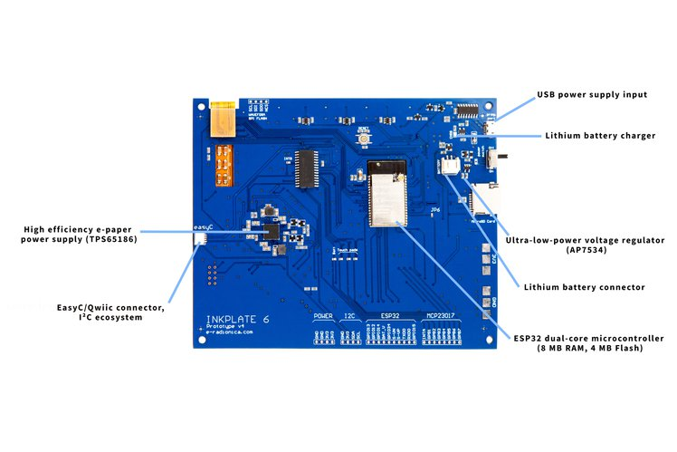

Other Technical Specifications
##############################
    | **Physical Interface**: three capacitive touch pads, hardware power switch, one LED battery indicator and hardware reset button
    | **Connectors**: USB-C, easyC, and GPIO
    | **Wired Connectivity**: USB, I²C, and SPI
    | **USB to UART converter**: CH340C
    | **Storage**: MicroSD card reader
    | **Power Management**: based on Texas Instruments (TI) TPS65186, MCP73831 lithium battery charger with a standard JST-PH 2-Pin right angle connector.
    | **Temperature Sensor**: Internal TPS65186

Inkplate 6PLUS
----------------

Front-Mounted Components:
#########################

.. image:: images/inkplate6plus_front.jpg
    :width: 500

Rear-Mounted Components:
########################

.. image:: images/inkplate6plus_back.jpg
    :width: 500

Other Technical Specifications
##############################
    | **Physical Interface**: touchscreen, backlight, hardware power switch, one LED battery indicator and hardware reset button.
    | **Connectors**: Micro USB, easyC, and GPIO.
    | **Wired Connectivity**: USB, I²C, and SPI.
    | **USB to UART converter**: CH340C.
    | **Storage**: MicroSD card reader.
    | **Power Management**: based on Texas Instruments (TI) TPS65186, MCP73831 lithium battery charger with a standard JST-PH 2-Pin right angle connector.
    | **Temperature Sensor**: Internal TPS65186.

Inkplate 10
------------

Front-Mounted Components:
#########################

.. image:: images/inkplate10_front.png
    :width: 500

Rear-Mounted Components:
########################

.. image:: images/inkplate10_back.png
    :width: 500

Other Technical Specifications
##############################
    | **Physical Interface**: three capacitive touch pads, push button for power and additional user button, form factor that is optimized for custom enclosures.
    | **Connectivity**: a USB Type-C port for programming and power, plenty of additional GPIO pins and support for I²C, SPI, and easyC/Qwiic connectivity.
    | Integrated Wi-Fi and Bluetooth 4.0 (BLE) support thanks to the on-board ESP32 module.
    | **USB to UART converter**: CH340C
    | **Storage**: MicroSD card reader
    | **Power Management**: based on Texas Instruments (TI) TPS65186, MCP73831 lithium battery charger with a standard JST-PH 2-Pin right angle connector.
    | **Temperature Sensor**: Internal TPS65186

Inkplate 6COLOR
----------------

Front-Mounted Components:
#########################

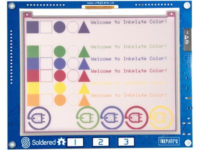

Rear-Mounted Components:
########################

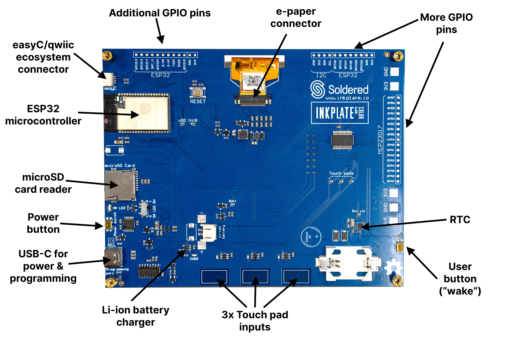

Other Technical Specifications
##############################
    | **Physical Interface**: three capacitive touch pads, push button for power and additional user button, form factor that is optimized for custom enclosures.
    | **Connectors**: USB type C, easyC, GPIO and battery.
    | **Wired Connectivity**: USB, I²C, and SPI.
    | **USB to UART converter**: CH340C.
    | **Storage**: MicroSD card reader.
    | **Power Management**: onboard SPD1656 Chip on Glass (also used as Active Matrix EPD Display Driver) for power supply, MCP73831 lithium battery charger with a standard JST-PH 2-Pin right angle connector.

Inkplate 2
----------------

Front-Mounted Components:
#########################

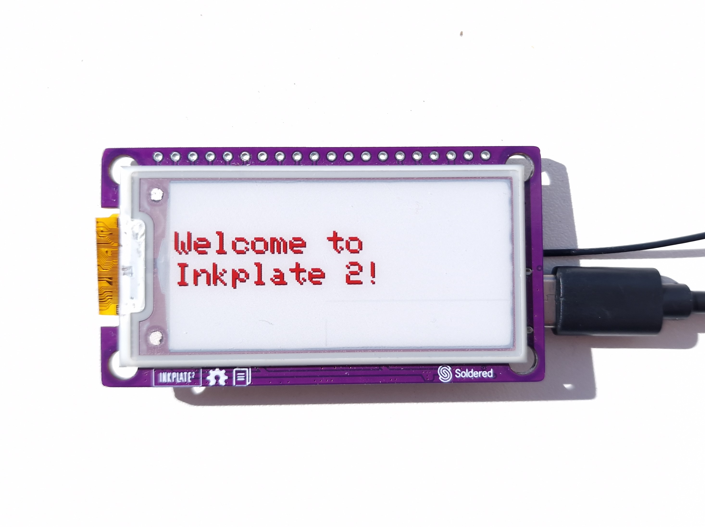

Rear-Mounted Components:
########################

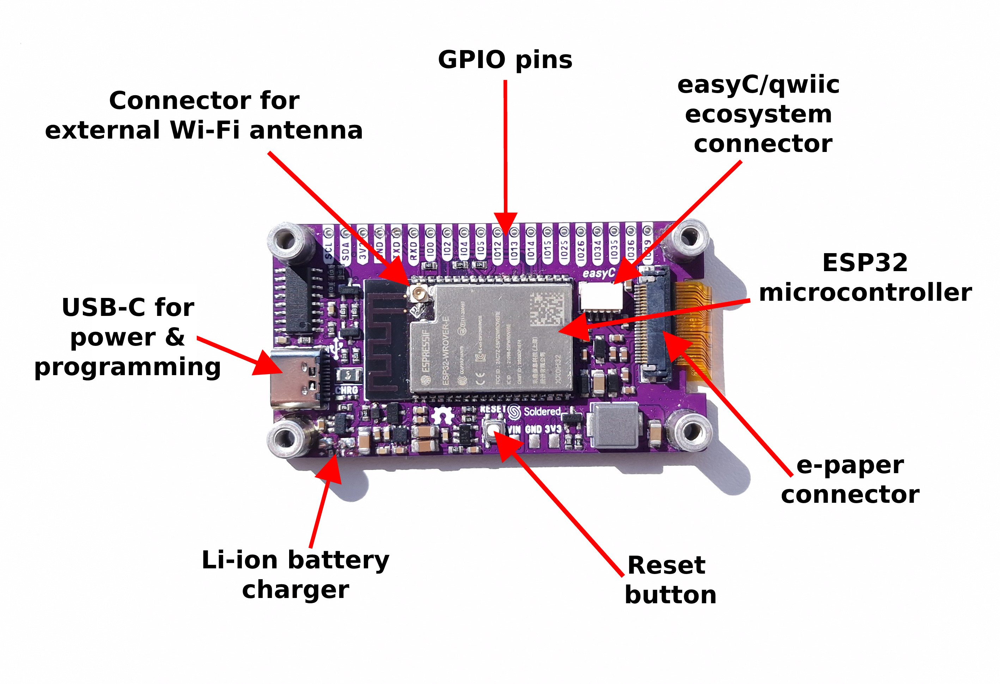

Other Technical Specifications
##############################
    | **Physical Interface**:GPIO pins, reset button and form factor that is optimized for custom enclosures.
    | **Connectors**: USB type C, easyC, GPIO and battery.
    | **Wired Connectivity**: USB, I²C, and SPI.
    | **USB to UART converter**: CH340C.
    | **Storage**: 4MB internal flash memory for user data.
    | **Power Management**: onboard Chip on Glass (also used as Active Matrix EPD Display Driver) for power supply, MCP73831 lithium battery charger and pads on board to solder battery.

Inkplate 5
----------------

Front-Mounted Components:
#########################

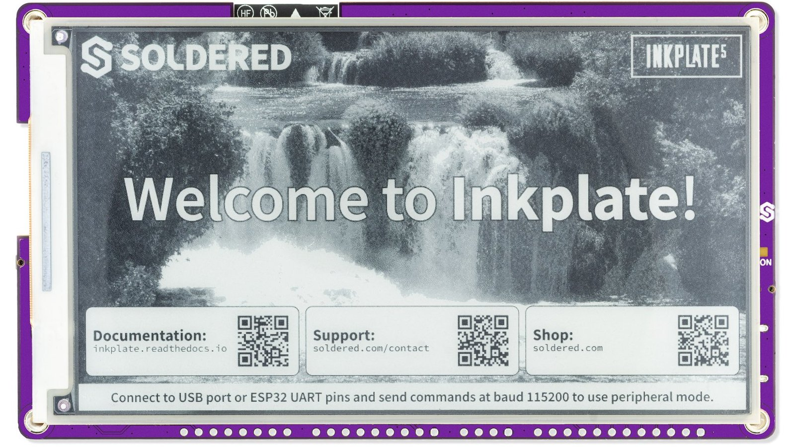

Rear-Mounted Components:
########################

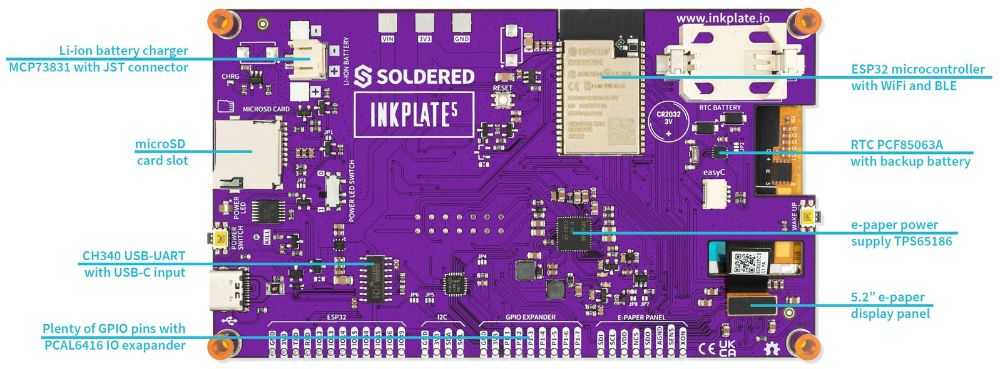

Other Technical Specifications
##############################
    | **Physical Interface**: hardware power switch, GPIO pins, reset button and form factor that is optimized for custom enclosures.
    | **Connectors**: USB type C, easyC, and GPIO
    | **Wired Connectivity**: USB, I²C, and SPI
    | **USB to UART converter**: CH340C
    | **Storage**: MicroSD card reader
    | **Power Management**: based on Texas Instruments (TI) TPS65186, MCP73831 lithium battery charger with a standard JST-PH 2-Pin right angle connector.
    | **Temperature Sensor**: Internal TPS65186

Inkplate 5 V2
----------------

Front-Mounted Components:
#########################

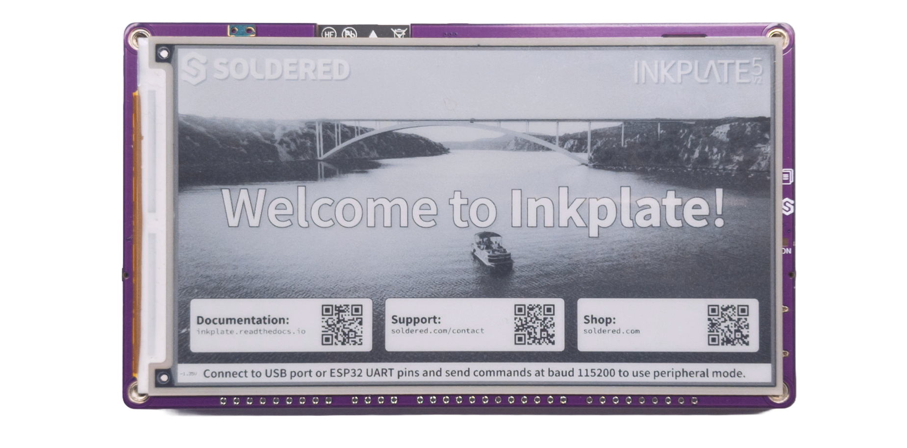

Rear-Mounted Components:
########################

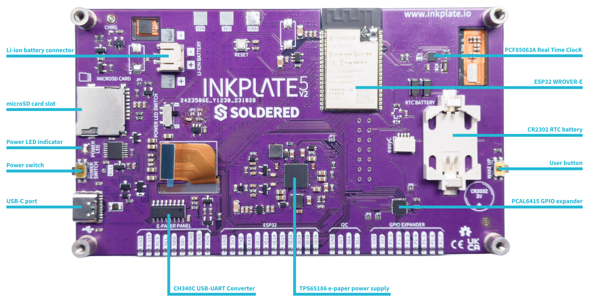

Other Technical Specifications
##############################
    | **Physical Interface**: hardware power switch, GPIO pins, reset button and form factor that is optimized for custom enclosures.
    | **Connectors**: USB type C, easyC, and GPIO
    | **Wired Connectivity**: USB, I²C, and SPI
    | **USB to UART converter**: CH340C
    | **Storage**: MicroSD card reader
    | **Power Management**: based on Texas Instruments (TI) TPS65186, MCP73831 lithium battery charger with a standard JST-PH 2-Pin right angle connector.
    | **Temperature Sensor**: Internal TPS65186

Inkplate 4TEMPERA
----------------

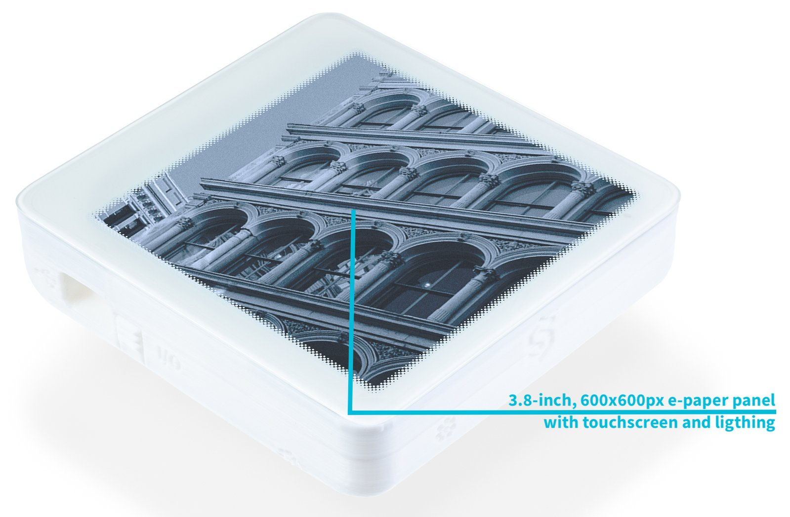

Front-Mounted Components:
#########################

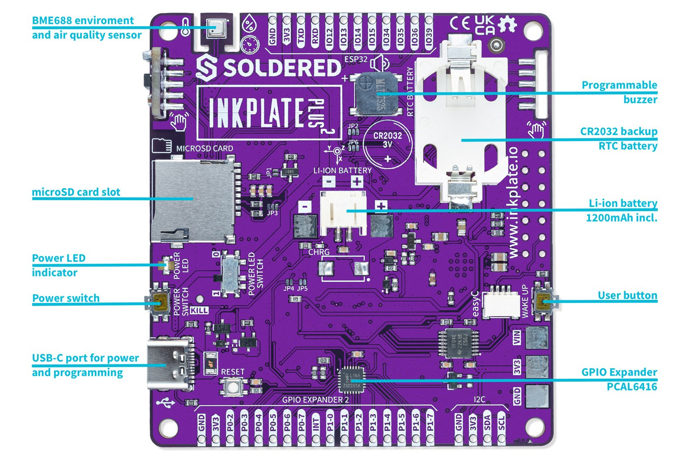

Rear-Mounted Components:
########################

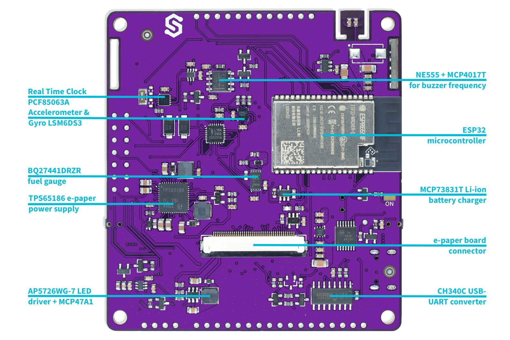

Screen
#########################
    | **Display Type**: 3-bit grayscale; black, white, and six shades of gray. 
      1-bit black-and-white mode available.
    | **Resolution**: 600 x 600 pixels.
    | **Partial-Refresh Time**: 0.18 seconds in 1-bit mode.
    | **Full-Refresh Time**: 0.86 seconds in both 1-bit and 3-bit modes.
    | **Touchscreen**: Multi-point touchscreen capability.
    | **Frontlighting**: Customizable LED, programmable for dimly lit environments.
    | **Eco-Friendly**: Sourced from recycled e-paper screens.

Key Electronic Components
#########################
    | **Microcontroller**: ESP32 with 8MB flash and 4MB RAM.
    | **USB-UART Converter**: CH340.
    | **GPIO Expander**: PCAL6416.
    | **Storage**: Onboard microSD card slot.

Connectivity
#########################
    | **Wireless**: Integrated Wi-Fi and Bluetooth LE.
    | **USB Port**: Type-C for programming and power.
    | **Peripheral**: easyC (qwiic / STEMMA QT) connectors.

Sensors
#########################
    | **Environmental Sensor**: BME688 for temperature, humidity, pressure, and air quality.
    | **Gesture Sensor**: Side-mounted APDS-9960.
    | **Motion Sensing**: Built-in LSM6DS3 gyroscope and accelerometer.
    | **Real-Time Clock**: PCF85063A, backed up by an auxiliary battery.

Power
#########################
    | **Consumption**: 18 µA in low-power mode.
    | **Power Supply**: Special e-paper TPS65186.
    | **Battery Charger**: Onboard MCP73831.
    | **Battery Status**: BQ27441DRZR for tracking SoC and more.
    | **Battery**: 1200-mAh Li-ion, within the enclosure.

Physical
#########################
    | **Dimensions**: 3.54 x 3.27 x 0.94 inches (90 x 83 x 24 mm).
    | **Variants**: Available with or without a glass panel.
