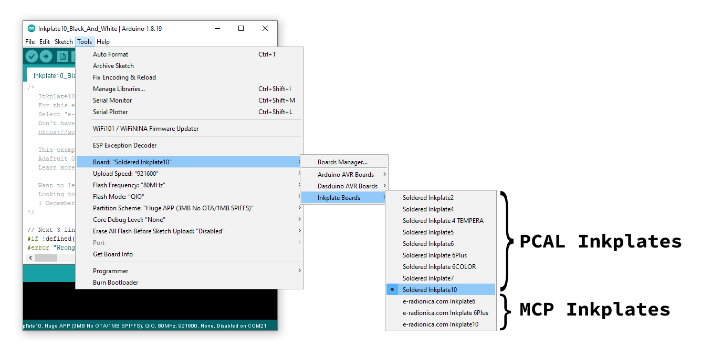

Inkplate Get Started Page
=========================

Arduino
-------

In order to get started with Inkplate using Arduino IDE, follow the steps below:

#. Install the `Inkplate board definition <https://github.com/SolderedElectronics/Dasduino-Board-Definitions-for-Arduino-IDE>`_ to add Inkplate as a board in Arduino IDE
#. Install the `CH340 drivers <https://soldered.com/learn/ch340-driver-installation-croduino-basic3-nova2/>`_ (if you don't have them already). **NOTE:** If you have Mac OSX 10.14 and greater, **do not install** this driver! Installing it on newer Mac OSX the Inkplate board won't be detected!
#. Install the `Inkplate Arduino library <https://github.com/SolderedElectronics/Inkplate-Arduino-library>`_ from our GitHub repository (if you're not sure how, take a look at our `tutorial <https://e-radionica.com/en/blog/arduino-library/#Kako%20instaliraty%20library?>`_)
#. Your Inkplate is now ready to go! Just select Tools -> Board -> Inkplate x, choose the correct COM port, and upload your code! To tweak your upload speed, you can set Upload speed to 115200. 

**NOTE: Make sure you select the correct board definition!** Using the wrong board definition will not work, the display won't update. Your Inkplate is either a "Soldered" Inkplate or an "e-Radionica" Inkplate (if it's an older model). The difference in board definition functionality is due to use of different GPIO expanders: PCAL6416A and MCP23017. Please refer to `this <https://inkplate.readthedocs.io/en/latest/arduino.html?highlight=pcal#io-expander-functions>`_ page for more info. 

Take a look at our `examples <examples.html>`_ in the library and the `API reference <api-reference.html>`_ to see what you can code.
To use `Peripheral Mode <peripheral-mode.html>`_, connect your Inkplate to the "Controller" board or computer with a USB cable or via the ESP32 RX and TX pins. For detailed reference see `Peripheral Mode <peripheral-mode.html>`_ docs.

MicroPython
-----------

In order to get started with Inkplate using MicroPython, please follow the guide in the `GitHub repository <https://github.com/SolderedElectronics/Inkplate-micropython?tab=readme-ov-file#setting-up-inkplate-with-micropython>`_.
    
ESP-IDF
-------

In order to get started with Inkplate using ESP-IDF, follow the steps below:

#. Clone `repo <https://github.com/turgu1/ESP-IDF-InkPlate.git>`_.

#. Setup ESP-IDF `tools <https://docs.espressif.com/projects/esp-idf/en/latest/esp32/get-started/>`_.

#. Connect Inkplate device and follow `instructions <https://docs.espressif.com/projects/esp-idf/en/latest/esp32/get-started/>`_.

#. You can run few examples from examples `folder <https://github.com/turgu1/ESP-IDF-InkPlate/tree/master/examples>`_ in repository.

Other information
-------

If you want to connect a battery to Inkplate, check the battery's polarity. See the `guide <https://inkplate.readthedocs.io/en/latest/hardware-reference.html#connect-a-battery-to-inkplate>`_ for more info.
