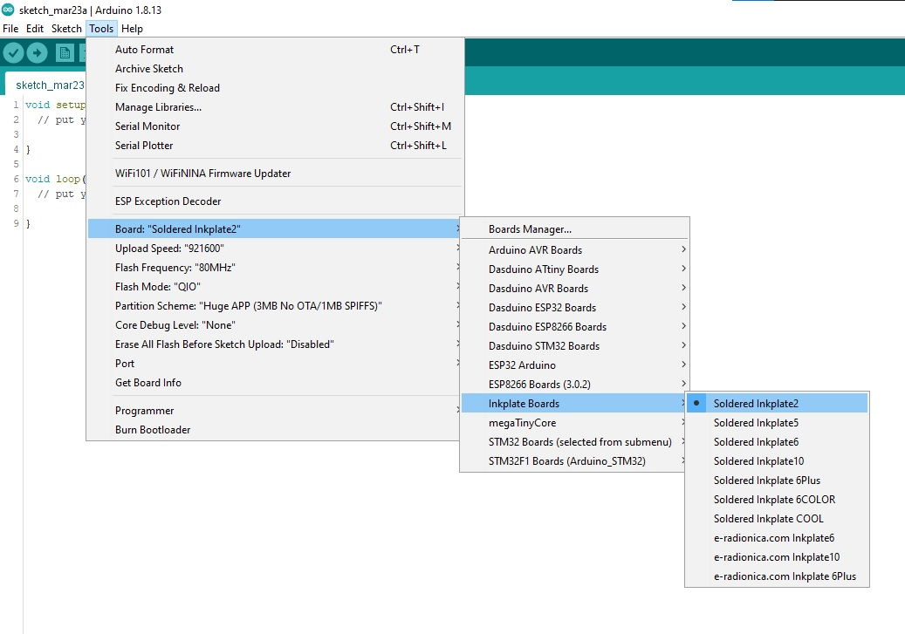

Inkplate Get Started Page
=========================

Arduino
-------

In order to get started with Inkplate using Arduino IDE, follow the steps below:

#. Install the `Inkplate board definition <https://github.com/SolderedElectronics/Dasduino-Board-Definitions-for-Arduino-IDE>`_ to add Inkplate as a board in Arduino IDE
#. Install the `CH340 drivers <https://soldered.com/learn/ch340-driver-installation-croduino-basic3-nova2/>`_ (if you don't have them already). **NOTE:** If you have Mac OSX 10.14 and greater, **do not install** this driver! Installing it on newer Mac OSX the Inkplate board won't be detected!
#. Install the `Inkplate Arduino library <https://github.com/SolderedElectronics/Inkplate-Arduino-library>`_ from our GitHub repository (if you're not sure how, take a look at our `tutorial <https://e-radionica.com/en/blog/arduino-library/#Kako%20instaliraty%20library?>`_)
#. Your Inkplate is now ready to go! Just select Tools -> Board -> Inkplate x, choose the correct COM port, and upload your code! To tweak your upload speed, you can set Upload speed to 921600. 

**NOTE: Make sure you select the correct board definition!** Using the wrong board definition will not work, the display won't update. Your Inkplate is either a "Soldered" Inkplate or an "e-Radionica" Inkplate (if it's an older model). The difference in board definition functionality is due to use of different GPIO expanders: PCAL6416A and MCP23017. Please refer to `this <https://inkplate.readthedocs.io/en/latest/arduino.html?highlight=pcal#io-expander-functions>`_ page for more info.

Take a look at our `examples <examples.html>`_ in the library and the `API reference <api-reference.html>`_ to see what you can code.
To use `Peripheral Mode <peripheral-mode.html>`_, connect your Inkplate to the "Controller" board or computer with a USB cable or via the ESP32 RX and TX pins. For detailed reference see `Peripheral Mode <peripheral-mode.html>`_ docs.

MicroPython
-----------

In order to get started with Inkplate using MicroPython, follow the steps below:

#. Clone our repo for `micropython <https://github.com/e-radionicacom/Inkplate-6-micropython>`_ and get your terminal inside the repo folder.
#. Flash MicroPython firmware supplied, or from the `official page <https://micropython.org/download/esp32/>`_
    To do so, run

    .. code-block:: python

        //Linux/Mac
        esptool.py --port /dev/cu.usbserial-1420 erase_flash

        //Windows
        esptool.py --port COM5 erase_flash

    to erase esp32 flash and then

    .. code-block:: python

        //Linux/Mac
        esptool.py --chip esp32 --port /dev/cu.usbserial-1420 write_flash -z 0x1000 esp32spiram-20210418-v1.15.bin

        //Windows
        esptool.py --chip esp32 --port COM5 write_flash -z 0x1000 esp32spiram-20210418-v1.15.bin

    to flash supplied firmware.
    If you don't have esptool.py installed, install it from here: `esptool <https://github.com/espressif/esptool>`_ at minimum use version 1.15..
    
#. Copy library files to your board, use inkplate6.py or inkplate10.py for respective versions, something like this:

    .. code-block:: python
    
        //Linux/Mac
        python3 pyboard.py --device /dev/ttyUSB0 -f cp mcp23017.py sdcard.py inkplate6.py image.py gfx.py gfx_standard_font_01.py :

        //Windows
        //This one might need to be started twice
        python pyboard.py --device COM5 -f cp inkplate6.py gfx.py gfx_standard_font_01.py mcp23017.py image.py shapes.py sdcard.py :

    Replace /dev/ttyUSB0 or COM5 with the port to which Inkplate is connected. Easiest way to find that out is to open Arduino IDE and see it under ports menu.
    (You can find pyboard.py in the MicroPython tools directory or just download it from GitHub: `pyboard <https://raw.githubusercontent.com/micropython/micropython/master/tools/pyboard.py>`_)

#. Run example.py:

    .. code-block:: 

        //Linux/Mac
        python3 pyboard.py --device /dev/ttyUSB0 "Examples/Inkplate6/basicBW.py

        //Windows
        python pyboard.py --device COM5 "Examples/Inkplate6/basicBW.py"

    Again replacing /dev/ttyUSB0 or COM5 with the correct port.
    You can run our othe examples, showing how to use the rest of inkplate functionality.
    In the same manner as running our examples you can run your own code and even set it to run on boot or similiar by following other MicroPython tutorials.
    
ESP-IDF
-------

In order to get started with Inkplate using ESP-IDF, follow the steps below:

#. Clone `repo <https://github.com/turgu1/ESP-IDF-InkPlate.git>`_.

#. Setup ESP-IDF `tools <https://docs.espressif.com/projects/esp-idf/en/latest/esp32/get-started/>`_.

#. Connect Inkplate device and follow `instructions <https://docs.espressif.com/projects/esp-idf/en/latest/esp32/get-started/>`_.

#. You can run few examples from examples `folder <https://github.com/turgu1/ESP-IDF-InkPlate/tree/master/examples>`_ in repository.
