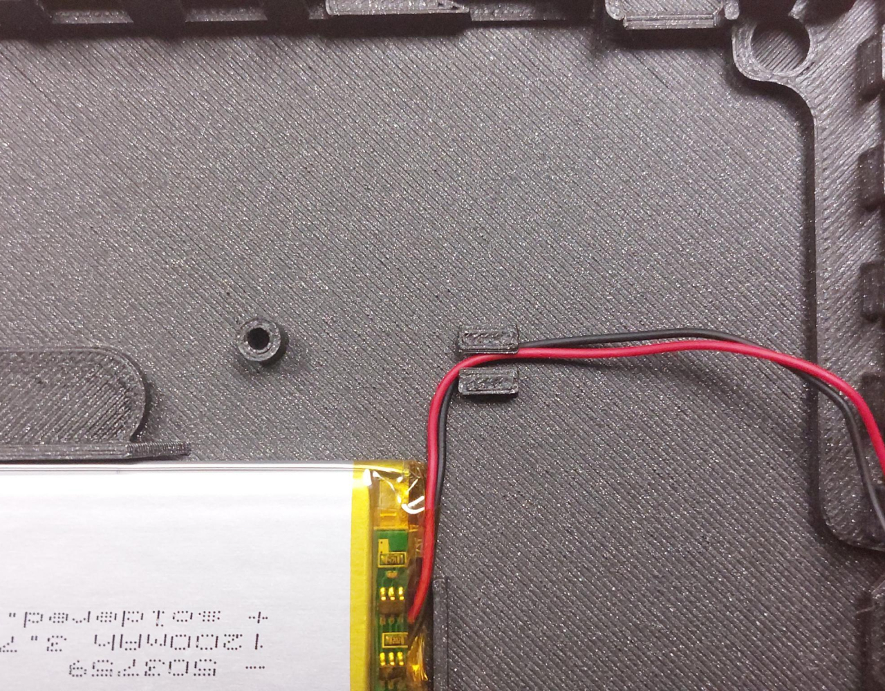

Inkplate Hardware Reference
============================

Inkplate family of e-paper displays is fully open-source and its full hardware design can be found in corresponding GitHub repositories:
    | `Inkplate 6 hardware <https://github.com/e-radionicacom/Inkplate-6-hardware>`_
    | `Inkplate 10 hardware <https://github.com/e-radionicacom/Inkplate-10-hardware>`_
    | `Inkplate 6PLUS hardware <https://github.com/e-radionicacom/Inkplate-6PLUS-Hardware>`_
    | `Inkplate 2 hardware <https://github.com/SolderedElectronics/Soldered-Inkplate-2-hardware-design>`_
    | Inkplate 5 hardware repository is coming soon

Additionally, all active Inkplate boards are OSHWA certified:
    | `Inkplate 6 OSHWA <https://certification.oshwa.org/hr000003.html>`_
    | `Inkplate 10 OSHWA <https://certification.oshwa.org/hr000006.html>`_

Short overview
----------------

The schematics speak for themselves, but here is the short introduction to Inkplate hardware. Most boards share the same basic components:
    | ESP32 - microcontroller as the brains of the whole board. WiFi with PCB antenna, BLE, 4MB Flash, 8MB PSRAM, 240MHz. Driving the e-paper parallel lines directly.
    | \*MCP23017 - I2C IO expander. Driving the misc (slower) e-paper lines and providing some extra GPIO pins.
    | \*PCAL6416A - I2C IO expander. Replacement for MCP in newer Inkplates in time of chip shortage.
    | e-paper panel - depending on the specific Inkplate, the contents are shown on EPD. There's a special connector for each of them. Some have a backlight and touchscreen and thus the additional circuitry for those. 
    | CH340C - USB-UART adapter, paired with USB-C for programming and power. 
    | \*microSD card slot.
    | \*\*TPS65186 - special EPD power management IC, providing specific voltages needed to drive EPD properly. 
    | MCP73831 - lithium-ion battery charger. Linear and not so efficient one, but simple to use. Auto-select voltage source is on board as well.
    | 22uA low-power thanks to low Iq voltage regulator from TI TPS7A2633.
    | \*3 pieces touch pads based on TTP223. 
    | Reset supervisor TPS3840PL27D takes care of proper reset at upload and manual reset. 
    | \*Pushbutton style power button thanks to MC14093BD logic gate and a single MOSFET.

        | *Note* \* *- Not available on every Inkplate, check Features page.*
        | *Note* \*\* *- Colored screens (Inkplate 2 and 6COLOR) have integrated EPD power management. The panels are completely off if they're not refreshing.*

Connect a battery to Inkplate
----------------

Inkplate boards can be powered via a Li-Ion battery. On Inkplate 2 the battery has to be soldered to the board. All other boards have a female JST connector, which makes connecting a battery quick and easy. Inkplate enclosures have a custom-made slot to hold the battery in place. Note that the size of the battery meant to be placed in the enclosure varies and is determined by it's mAh capacity. If you wish to add a battery which will fit your enclosure for sure, please refer to our website for more info regarding which mAh capacity to get, search for 'battery' on the product page of your Inkplate.

Here's how to do it, first, prepare your Inkplate and battery:

Open up Inkplate's enclosure, there's an easy opening labeled with 'OPEN HERE':

Take out Inkplate from the enclosure, it should easily come out:

Place the battery in the enclosure in the battery slot:

Note the positioning of this cable insert which is used for cable management, insert the battery's cable through it:

Now, connect the battery's connector to the board. **IMPORTANT!** Note the location of the + and - sides of the battery, connecting this wrong could damage your Inkplate! It's also clearly marked on the board: 

Now, with everything connected, it should look like this:

Inkplate should now be powered via battery! Close everything up and try turning it on via the button:

